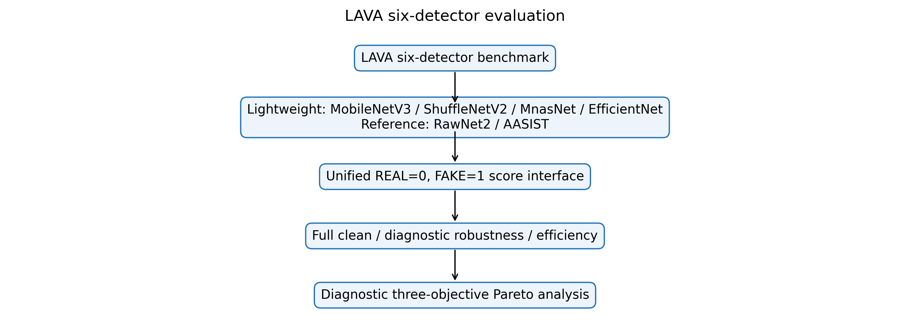
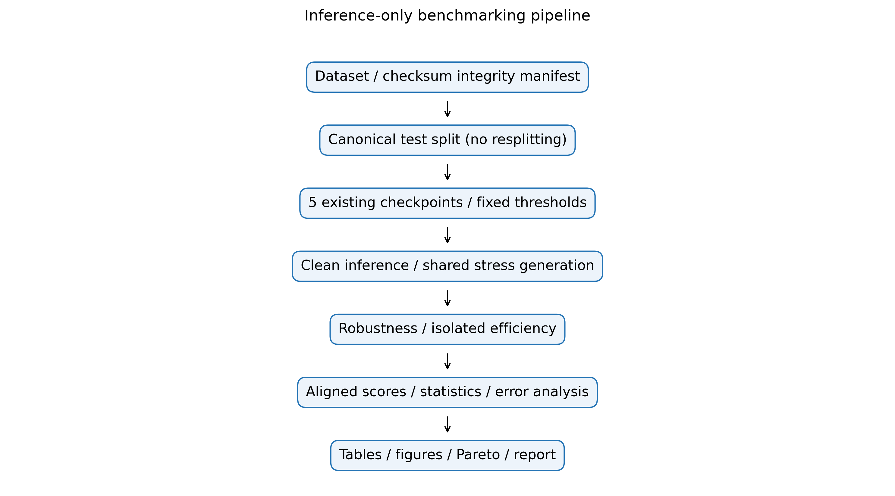
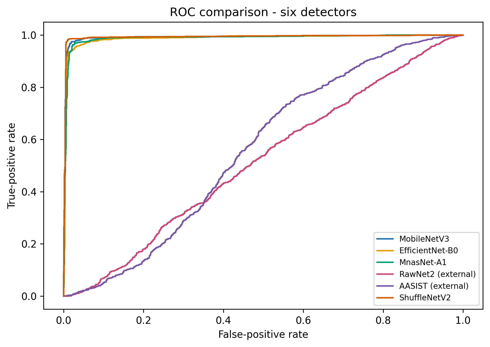
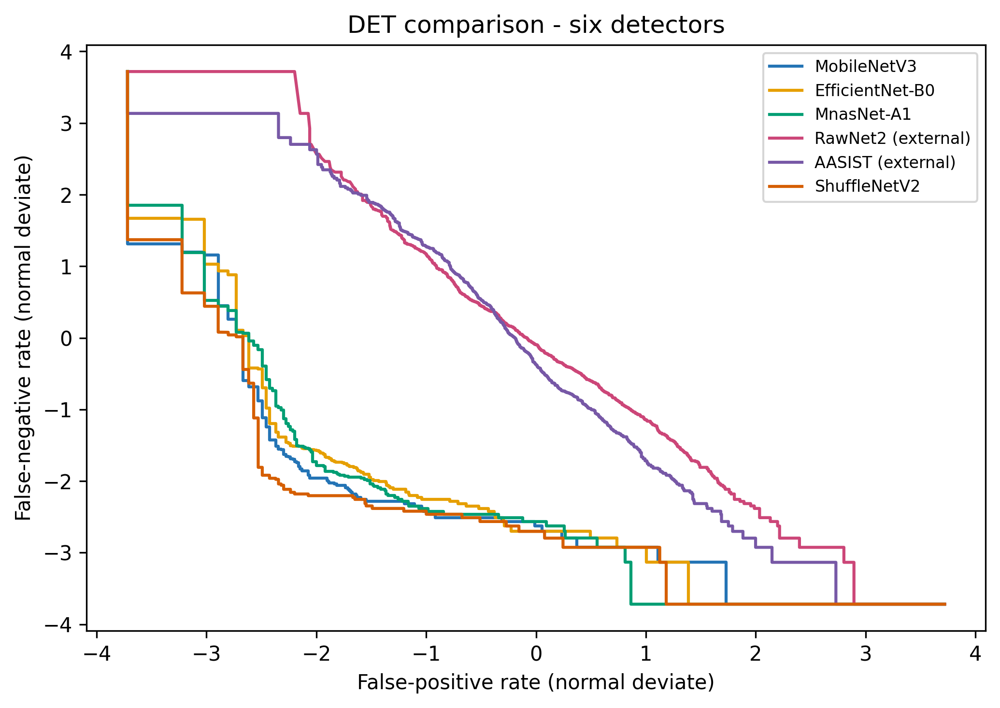
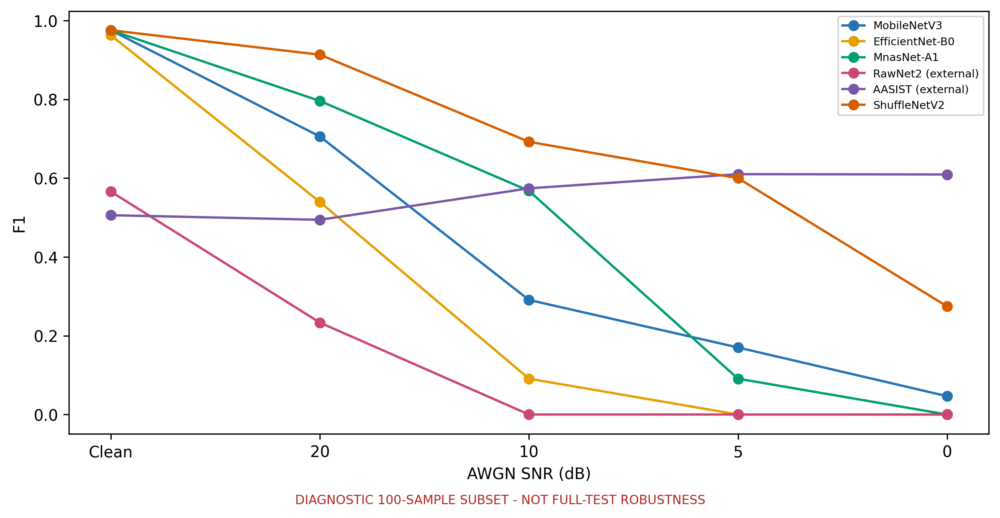
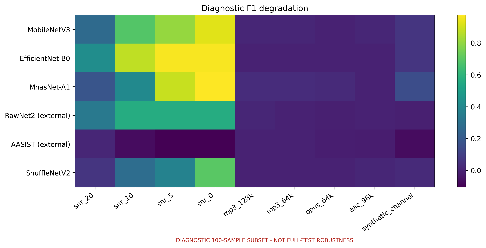
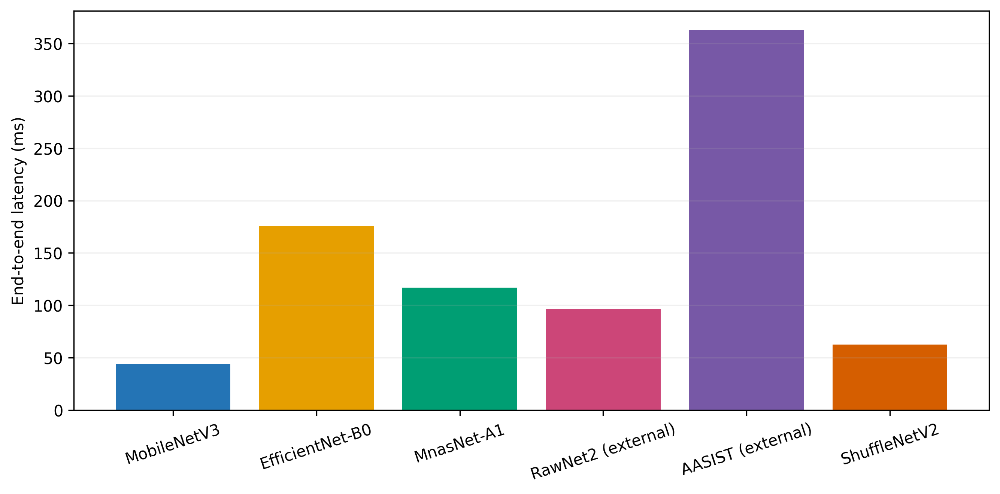
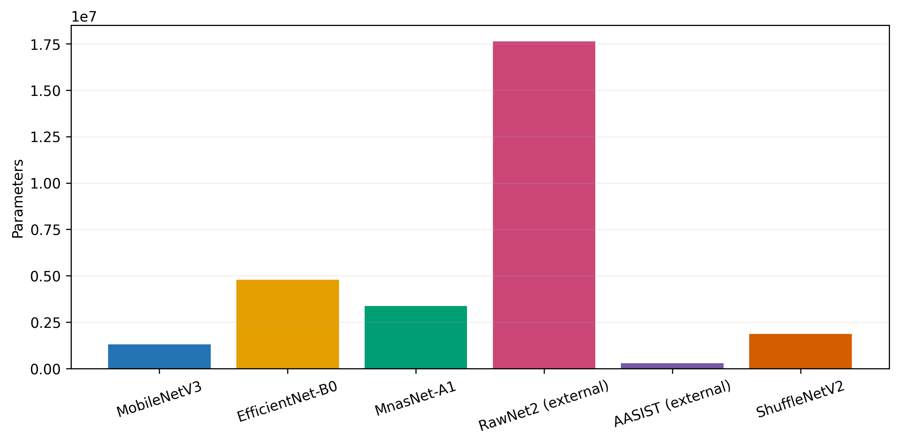
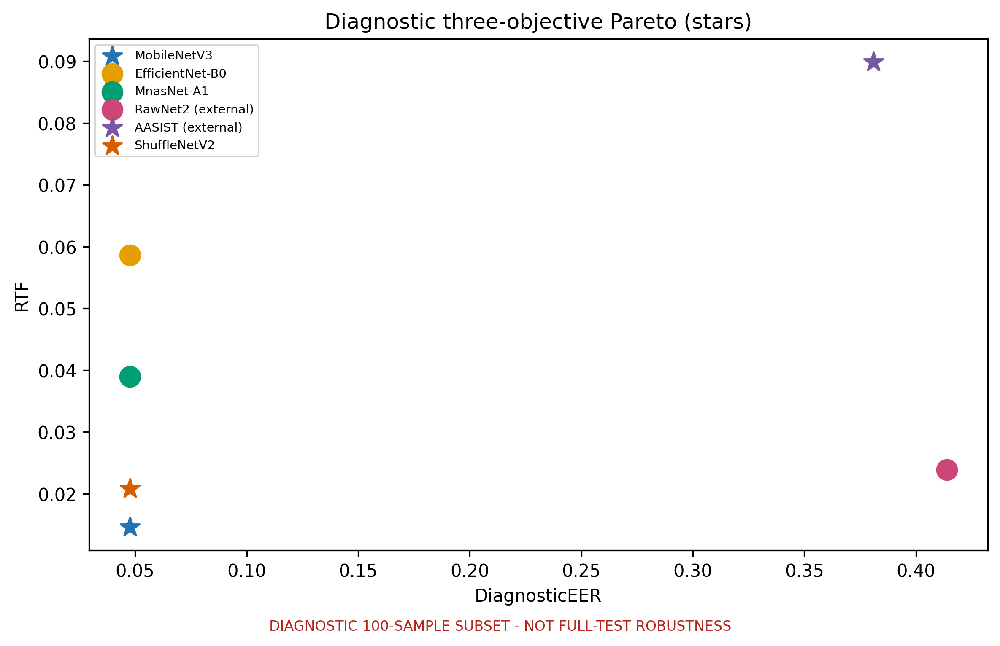
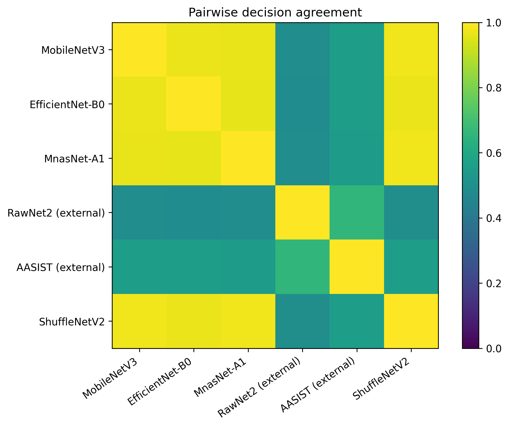

# LAVA: A Lightweight Benchmarking Framework for Robust and Real-Time Deepfake Voice Detection

**Current manuscript status:** six-detector clean benchmark with fixed-subset diagnostic robustness; full-test robustness remains incomplete.

## Abstract

Deepfake-voice detectors are commonly compared across different data partitions, score conventions, preprocessing pipelines, and runtime protocols, making accuracy–efficiency claims difficult to interpret. This paper presents LAVA, a registry-based framework that evaluates heterogeneous detectors through a common label, score, integrity, robustness, and timing contract while preserving their native architectures. The current study evaluates six artifacts: four LAVA-trained Mel-sequence detectors—MobileNetV3Small-LSTM, ShuffleNetV2-1.0x-LSTM, EfficientNet-B0-LSTM, and MnasNet-A1-LSTM—and externally pretrained RawNet2 and AASIST references. SHA-256 grouping quarantined 30 byte-identical cross-label files and prevented same-checksum leakage. Clean evaluation used all 2,737 canonical test recordings. ShuffleNetV2 achieved the strongest clean result (F1 0.9824, ROC-AUC 0.9929, EER 1.46%), while MobileNetV3 provided the lowest measured end-to-end latency (43.8 ms). ShuffleNetV2 required 62.5 ms (RTF 0.0208) on the same single-thread desktop CPU. Robustness was evaluated diagnostically—not as a full-test result—on a fixed stratified 100-recording subset under seeded white noise, four codec round trips, and one simulated replay channel. ShuffleNet's mean F1 degradation was 0.1623 across nine conditions; low-SNR noise remained the dominant failure mode. The diagnostic three-objective Pareto set contained MobileNetV3, ShuffleNetV2, and AASIST. The reference checkpoints performed substantially worse under the present clean dataset and adapter protocol, but provenance and input-contract differences preclude an architecture-only interpretation. These findings support reproducible deployment-oriented comparison, but not physical-replay, unseen-dataset, edge-device, multi-seed, or full-test robustness claims.

**Keywords—** deepfake voice detection; audio anti-spoofing; lightweight deep learning; robustness; real-time factor; Pareto analysis.

## 1. Introduction

### 1.1 Background and motivation

Synthetic and converted speech challenge both human listeners and automatic speaker-verification systems. Community benchmarks such as ASVspoof formalized logical- and physical-access threat models [1], while WaveFake broadened publicly available generated-audio resources [2]. The resulting literature includes engineered acoustic features, raw-waveform networks, graph-attention systems, and compact convolutional backbones. Reported quality alone, however, does not answer whether a detector is robust to channel distortion or usable under a constrained runtime.

Comparison is especially fragile when systems encode opposite class orders, expose logits rather than comparable probabilities, use incompatible durations, or time only the neural forward pass for one model and the complete pipeline for another. Dataset duplication provides a second failure mode: byte-identical audio can inflate held-out performance when copies enter different splits. LAVA addresses these experimental-interface problems rather than asserting that one internal architecture fits every detector.

### 1.2 Research gap

RawNet2 directly models waveforms [6], AASIST preserves interacting spectral and temporal graph representations [7], and mobile CNN families were designed around different efficiency principles [3–5]. Forcing these systems into one topology would destroy useful architectural diversity. Conversely, evaluating them without a common contract confounds architecture, score semantics, data integrity, and measurement policy. A reproducible framework must therefore standardize the evaluation boundary while retaining native computation inside that boundary.

The present repository provides such a boundary for four locally trained lightweight artifacts with unequal initialization histories and two externally pretrained references. Clean evaluation is complete for all six; robustness has been completed only on a fixed diagnostic subset. This paper reports that mixed scope explicitly.

### 1.3 Research questions

**RQ1:** How competitive are the four lightweight temporal CNN detectors relative to two externally pretrained anti-spoofing systems under the common clean LAVA evaluation protocol?

**RQ2:** How does detection performance change under the noise, codec, and simulated-replay conditions actually executed in the current diagnostic evaluation?

**RQ3:** Which evaluated detectors are non-dominated when EER, mean robustness degradation, and end-to-end RTF are considered jointly within the completed diagnostic scope?

### 1.4 Contributions

This work contributes: (1) a framework-neutral `P(FAKE)` contract across TensorFlow and externally trained PyTorch/ONNX detectors; (2) a checksum-aware integrity protocol that quarantines cross-label conflicts and prevents byte-identical split leakage; (3) an artifact-traceable six-detector clean benchmark and fixed-subset robustness diagnostic; (4) a common CPU protocol separating preprocessing, model-only, and end-to-end latency; and (5) measured error, bootstrap, agreement, and Pareto analyses without an arbitrary weighted ranking.

## 2. Related Work

### 2.1 Audio deepfake and anti-spoofing benchmarks

ASVspoof 2019 framed synthetic, converted, and replayed speech within logical- and physical-access scenarios and retained EER alongside the tandem detection cost function [1]. WaveFake assembled generated audio from multiple synthesis families and languages [2]. These works motivate domain-diverse evaluation, but the current LAVA dataset is not claimed to reproduce either protocol. In particular, no verified external WaveFake evaluation exists in the repository.

### 2.2 Raw-waveform anti-spoofing

RawNet2 was adapted to anti-spoofing as an end-to-end raw-waveform model [6]. Its native structure is materially different from an image-backbone classifier. LAVA consequently preserves waveform input, a Sinc-style front end, residual temporal processing, attention, a GRU, and a classifier. The present RawNet2 weights are external rather than retrained by LAVA.

### 2.3 Spectro-temporal graph detectors

AASIST integrates spectral and temporal graph representations using heterogeneous graph attention, graph pooling, master/stack nodes, and extended readout [7]. LAVA retains this native graph computation and adapts only loading and score semantics. It does not turn AASIST into a Mel-CNN-LSTM.

### 2.4 Lightweight convolutional architectures

MobileNetV3 combines hardware-aware search and architecture refinements for low-resource vision inference [3]. EfficientNet jointly scales depth, width, and resolution [4]. MnasNet uses platform-aware neural architecture search with latency in its search objective [5]. LAVA uses these vision backbones as per-segment embedding functions in a controlled audio-temporal meta-architecture. Their original vision results are context, not LAVA audio results.

ShuffleNetV2 follows practical efficiency principles [8] and is integrated as a scratch-trained LAVA detector. Its full backbone, BatchNormalization layers, LSTM, and head were optimized jointly from epoch 1; the restored best validation-loss checkpoint was used for evaluation.

### 2.5 Robustness and deployment-oriented evaluation

Noise, codec transforms, and replay channels can perturb cues on which detectors rely. A useful robustness protocol must generate each stress recording once and reuse it across models, retain sample identity, and report degradation against matched clean samples. Likewise, FLOPs alone cannot establish wall-clock suitability. LAVA records serialized size, process RSS, preprocessing and inference time, throughput, and real-time factor. The present measurements are desktop-CPU evidence, not validation on a phone, IoT device, or embedded accelerator.

## 3. Methodology

### 3.1 LAVA framework overview

LAVA separates model-native computation from a unified evaluation layer (Fig. 1). Detector specifications declare framework, input type, duration, artifact paths, and provenance. Adapters expose loading, score prediction, parameter count, and model size. The benchmark seals model, metadata, threshold, manifest, and inference-source hashes before execution. Completed per-sample score files are hashed and metrics are recomputed during report generation.

The execution pipeline (Fig. 2) verifies the canonical manifest, loads each artifact in an isolated sequential worker, evaluates unchanged scores, generates shared stress audio, measures runtime, and derives tables and figures programmatically.

### 3.2 Dataset and integrity protocol

The repository dataset is an internal binary collection stored under `data/REAL` and `data/FAKE`; its speaker, source, generator, parent-recording, and dataset identifiers are all `UNKNOWN`. Accordingly, LAVA makes no ASVspoof-sized, speaker-disjoint, source-disjoint, generator-disjoint, or cross-dataset claim for this collection.

Inventory scanned 18,722 files: 10,550 labeled REAL and 8,172 labeled FAKE. SHA-256 analysis found 435 duplicate groups, 476 redundant duplicate files, and 14 cross-label checksum groups involving 30 files. Every cross-label member was quarantined at manifest level. For a same-label checksum group, the lexicographically first path was retained as the canonical representative and other copies were excluded. The final manifest contains 18,232 recordings (10,493 REAL; 7,739 FAKE), split deterministically with seed 42 into 12,762 training, 2,733 validation, and 2,737 test recordings. The supported claim is therefore **checksum-group-disjoint only**. The manifest hash is `8b55591d58d3658b8cafe0e77b6ebdedbaa67be2e339730a7276fe9b10958df9`.

### 3.3 Standardized audio preprocessing

For the lightweight family, audio is decoded with SoundFile where supported, converted to mono by channel averaging, resampled with polyphase filtering to 22,050 Hz, and zero-padded or truncated to 3.0 s (66,150 samples). The signal is divided chronologically into six non-overlapping 0.5-s segments. Each segment uses a Hann-window STFT with `n_fft=2048` and hop length 512. A 128-band HTK-style triangular Mel bank spans 20–8,000 Hz. Power is converted to decibels relative to the segment maximum and clipped to an 80-dB range. Linear mapping yields [0,255], bilinear resizing yields 224×224, and channel replication yields an RGB tensor. One recording therefore has shape `6×224×224×3` in float32.

Reference adapters instead load mono 16-kHz waveforms of 64,600 samples (4.0375 s). The retained production adapters use polyphase resampling and prefix/zero-padding. The reference repositories use librosa and repetition padding for short files. This documented deviation was not changed after test inspection. Native-checkpoint versus ONNX parity uses identical adapter tensors and therefore verifies export fidelity, not equivalence to the original publication pipeline.

### 3.4 Evaluated detector families

**Table 1. Detector configuration and artifact provenance.**

| Detector | Category | Runtime | Input/duration | Architecture and temporal mechanism | Parameters | Artifact/training provenance |
|---|---|---|---|---|---:|---|
| MobileNetV3Small-LSTM | lightweight | TensorFlow 2.15 | Mel sequence, 3.0 s | TimeDistributed MobileNetV3Small (576-D), LSTM(128), dense head | 1,308,401 | LAVA-trained; ImageNet initialization |
| EfficientNet-B0-LSTM | lightweight | TensorFlow 2.15 | Mel sequence, 3.0 s | TimeDistributed EfficientNet-B0 (1280-D), LSTM(128), dense head | 4,779,300 | LAVA-trained; ImageNet; best available warm-up checkpoint |
| MnasNet-A1-LSTM | lightweight | TensorFlow 2.15 | Mel sequence, 3.0 s | TimeDistributed MnasNet-A1 (1280-D), LSTM(128), dense head | 3,369,255 | LAVA-trained end-to-end from scratch; early-stopped best |
| ShuffleNetV2-1.0x-LSTM | lightweight | TensorFlow 2.15 | Mel sequence, 3.0 s | TimeDistributed ShuffleNetV2 (1024-D), LSTM(128), dense head | 1,868,441 | LAVA-trained end-to-end from scratch; early-stopped best |
| RawNet2 | reference | ONNX Runtime export of PyTorch | waveform, 4.0375 s | Sinc/residual/attention/GRU | 17,621,410 | external checkpoint; reference README associates it with ASVspoof 2019 LA |
| AASIST | reference | ONNX Runtime export of PyTorch | waveform, 4.0375 s | Sinc/2-D encoder/spectral-temporal heterogeneous graph attention/readout | 297,866 | external checkpoint; reference README associates it with ASVspoof 2019 LA |

Parameter counts come from loaded Keras models for lightweight detectors and strictly loaded native PyTorch parameters for reference detectors. The conventions differ because Keras counts non-trainable BatchNorm state whereas the native count excludes buffers.

All lightweight models share `TimeDistributed(backbone) → LSTM(128) → Dense(64, ReLU) → Dropout(0.4) → Dense(1, sigmoid)`. Backbone embedding width is not artificially equalized. RawNet2 and AASIST retain their native architectures.

### 3.5 Training and artifact provenance

MobileNetV3 used ImageNet initialization and the repository's two-stage lifecycle: frozen-backbone head warm-up followed by lower-rate partial fine-tuning with BatchNorm frozen. EfficientNet also uses ImageNet initialization, but the available deployment is explicitly the best warm-up checkpoint (warm-up epoch 47, validation loss 0.1698), not a completed global-best fine-tuning lifecycle. MnasNet was trained from scratch, end-to-end from epoch 1; its deployed artifact is the best restored epoch 27 from an early-stopped 39-epoch run. ShuffleNet was likewise trained end-to-end from scratch with all 56 BatchNormalization layers trainable; the deployed artifact is restored from best epoch 16 of an early-stopped 28-epoch run. Its recorded Adam learning rate is `3e-4`. Thus evaluation is shared, but initialization and optimization are not identical.

RawNet2 and AASIST were not trained by the LAVA trainer. Their source `.pth` files were strictly loaded in PyTorch and exported to self-contained ONNX graphs. Six real sample tensors produced maximum native-versus-ONNX `P(FAKE)` differences of `4.11×10⁻⁶` for RawNet2 and `5.96×10⁻⁸` for AASIST. These tests establish numerical adapter/export parity, not equal training provenance.

### 3.6 Score semantics and thresholds

LAVA fixes REAL=0 and FAKE=1. Every adapter returns a bounded score (p=P(FAKE)), and

$$
\hat y=\begin{cases}1,&p\ge\tau,\\0,&p<\tau.\end{cases}\tag{1}
$$

The lightweight thresholds—0.82 for MobileNet, 0.90 for EfficientNet and MnasNet, and 0.12 for ShuffleNet—were calibrated by FAKE-class F1 on validation data. RawNet2 and AASIST retain uncalibrated default thresholds of 0.5. Test labels never choose weights or thresholds. Scores are not claimed to be calibrated real-world probabilities.

### 3.7 Clean evaluation protocol

Clean evaluation uses all 2,737 test samples (1,575 REAL, 1,162 FAKE). For FAKE as the positive class,

$$Precision=\frac{TP}{TP+FP},\quad Recall=\frac{TP}{TP+FN},\quad F1=\frac{2PR}{P+R}.\tag{2}$$

ROC-AUC is computed from raw (P(FAKE)), never thresholded labels. For a threshold (\tau),

$$FAR(\tau)=\frac{FP}{FP+TN},\qquad FRR(\tau)=\frac{FN}{FN+TP}.\tag{3}$$

The implementation finds the first sign change of (FAR-FRR), linearly interpolates, and reports

$$EER=\frac{FAR(\tau^*)+FRR(\tau^*)}{2},\quad FAR(\tau^*)\simeq FRR(\tau^*).\tag{4}$$

### 3.8 Robustness stress tests

Runtime estimates made full-test stress evaluation impractical in the current execution. Before observing model errors, a deterministic stratified subset of 100 test recordings (58 REAL, 42 FAKE; seed 42) was selected. The clean baseline for every degradation is derived from exactly those IDs. All diagnostic figures carry a warning and are stored separately from full-test results.

Noise uses seeded additive white Gaussian noise at 20, 10, 5, and 0 dB, with exact whole-prefix RMS SNR and float32 WAV storage. Compression uses FFmpeg round trips through MP3 at 128 and 64 kb/s, Opus at 64 kb/s, and AAC at 96 kb/s; PCM16 conversion is part of the condition. Simulated replay applies direct and delayed taps at 0, 17, 43, and 89 ms with gains 1, 0.45, 0.25, and 0.12, fixed normalization, and a causal fourth-order 100–3,800-Hz Butterworth band-pass. It is not physical replay or a measured room impulse response.

For higher-is-better F1, (\Delta F1=F1_{clean}-F1_{stress}); lower is better. The overall diagnostic degradation is the arithmetic mean across all nine individual conditions, not a weighted category score. Negative degradation denotes an improvement on this small subset and should not be over-interpreted. No unseen/cross-dataset result exists.

### 3.9 Computational efficiency protocol

Each model runs in a sequential isolated process on the same Windows desktop CPU, float32, batch size one, and one computational thread per backend. Ten warm-up runs precede 50 timed repetitions. The runner reports mean, median, standard deviation, P95, preprocessing, model-only and end-to-end time, throughput, load time, and process RSS sampled every 20 ms. Interpreter startup and graph tracing are excluded from warm timings. RSS is whole-process memory, not model-only peak allocation.

$$RTF=\frac{T_{processing}}{T_{audio}},\qquad Throughput=\frac{N_{clips}}{T_{total}},\qquad S_{model}=\frac{bytes}{1024^2}.\tag{5}$$

RTF below one means offline processing completed faster than clip duration; it does not demonstrate causal streaming. No edge hardware was tested.

### 3.10 Pareto analysis

The diagnostic Pareto objectives minimize clean-subset EER, mean F1 degradation, and end-to-end RTF. Model (A) dominates (B) iff

$$f_i(A)\le f_i(B)\ \forall i,\qquad \exists j:f_j(A)<f_j(B).\tag{6}$$

No weighted composite score is used. Because robustness is subset diagnostic, this frontier is exploratory; the official full-test frontier remains `NOT_RUN`.

### 3.11 Statistical and error analysis

The full clean scores support 1,000 shared stratified bootstrap resamples (seed 42), producing percentile 95% intervals for F1, AUC, and EER. These quantify test-sample uncertainty, not training-seed uncertainty. Pairwise correctness is compared using exact McNemar tests with Holm adjustment, and paired bootstrap intervals characterize F1 differences. Agreement and error-overlap matrices require identical sample-ID order before calculation.

## 4. Results

### 4.1 Experimental artifact coverage

All six artifacts passed loading, bounded-score, two-class probe, artifact-hash, and public-adapter parity checks. The native checkpoint-to-ONNX parity checks passed for both external references. ShuffleNet's converted TensorFlow 2.15 artifact preserved source scores within `1.75×10^-10`, loaded with 1,868,441 parameters, and matched the canonical training-manifest hash.

### 4.2 RQ1—clean detection performance

**Table 2. Full canonical-test clean performance.**

| Model | Accuracy | Precision | Recall | F1 | Macro F1 | ROC-AUC | EER | TN/FP/FN/TP |
|---|---:|---:|---:|---:|---:|---:|---:|---|
| MobileNetV3-LSTM | 0.9766 | 0.9741 | 0.9707 | **0.9724** | **0.9761** | **0.9911** | **0.0250** | 1545/30/34/1128 |
| EfficientNet-B0-LSTM | 0.9635 | 0.9724 | 0.9406 | 0.9563 | 0.9624 | 0.9877 | 0.0400 | 1544/31/69/1093 |
| MnasNet-A1-LSTM | 0.9697 | 0.9599 | 0.9690 | 0.9645 | 0.9690 | 0.9886 | 0.0310 | 1528/47/36/1126 |
| ShuffleNetV2-LSTM | **0.9850** | **0.9795** | **0.9854** | **0.9824** | **0.9847** | **0.9929** | **0.0146** | 1551/24/17/1145 |
| RawNet2 external | 0.4936 | 0.4380 | 0.6807 | 0.5330 | 0.4900 | 0.5178 | 0.4813 | 560/1015/371/791 |
| AASIST external | 0.5513 | 0.4758 | 0.5585 | 0.5139 | 0.5487 | 0.5597 | 0.4463 | 860/715/513/649 |

The four lightweight artifacts substantially outperformed the two external checkpoints under this specific test and adapter contract. ShuffleNet led the reported clean aggregates; MobileNet remained the fastest. This observation is not a controlled architecture ranking because initialization, training provenance, thresholds, durations, preprocessing, and adaptation differ. The full-score ROC and DET curves in Figs. 3 and 4 show strong separation for all four lightweight models and near-diagonal behavior for the external references.

### 4.3 RQ2—diagnostic robustness

**Table 3. Matched 100-sample diagnostic robustness. Values are mean F1 degradation; lower is better.**

| Model | Subset clean F1 | Noise ΔF1 | Codec ΔF1 | Simulated replay ΔF1 | Mean over 9 conditions |
|---|---:|---:|---:|---:|---:|
| MobileNetV3-LSTM | 0.9756 | 0.6722 | 0.0095 | 0.0620 | 0.3099 |
| EfficientNet-B0-LSTM | 0.9630 | 0.8053 | 0.0000 | 0.0641 | 0.3650 |
| MnasNet-A1-LSTM | 0.9756 | 0.6119 | 0.0233 | 0.1489 | 0.2989 |
| ShuffleNetV2-LSTM | 0.9756 | **0.3555** | 0.0032 | **0.0256** | **0.1623** |
| RawNet2 external | 0.5660 | 0.5077 | −0.0007 | −0.0109 | 0.2241 |
| AASIST external | 0.5060 | −0.0660 | −0.0074 | −0.0682 | −0.0402 |

Codec round trips caused little mean F1 change for the lightweight detectors, while AWGN caused substantial degradation, particularly at low SNR (Fig. 5). ShuffleNet's replay F1 was 0.9500 and its codec mean degradation was 0.0032, but its noise mean degradation was 0.3555. Negative changes for weak external baselines do not establish robustness: a low and unstable starting F1 can improve under perturbation by chance or score redistribution. The subset is too small for definitive model ordering.

### 4.4 Computational efficiency

**Table 4. Measured single-thread desktop-CPU efficiency.**

| Model | Params | Size MiB | RSS MiB | Preprocess ms | Model-only ms | End-to-end mean/P95 ms | Throughput clips/s | RTF |
|---|---:|---:|---:|---:|---:|---:|---:|---:|
| MobileNetV3-LSTM | 1,308,401 | 5.64 | 554.6 | 13.43 | 30.07 | **43.81/52.12** | **22.83** | **0.0146** |
| EfficientNet-B0-LSTM | 4,779,300 | 18.96 | 651.2 | 13.59 | 168.36 | 175.85/196.11 | 5.69 | 0.0586 |
| MnasNet-A1-LSTM | 3,369,255 | 13.43 | 566.0 | 13.60 | 95.25 | 117.00/138.96 | 8.55 | 0.0390 |
| ShuffleNetV2-LSTM | 1,868,441 | 7.74 | 501.8 | 15.57 | 48.05 | 62.52/75.37 | 15.99 | 0.0208 |
| RawNet2 external | 17,621,410 | 67.65 | 249.5 | 0.63 | 95.10 | 96.54/102.62 | 10.36 | 0.0239 |
| AASIST external | 297,866 | **1.61** | 442.5 | **0.47** | 359.61 | 362.91/398.45 | 2.76 | 0.0899 |

MobileNet produced the best measured latency and RTF; ShuffleNet ranked second among the TensorFlow detectors on both measures. AASIST had the smallest serialized artifact but the largest latency. Thus parameter count or file size alone did not predict runtime. All RTF values were below 0.1 for offline batch-one inference, but this is neither streaming nor edge-device validation.

### 4.5 RQ3—exploratory Pareto trade-offs

**Table 5. Diagnostic three-objective Pareto result.**

| Model | Subset EER | Mean ΔF1 | RTF | Non-dominated? |
|---|---:|---:|---:|---|
| MobileNetV3-LSTM | 0.0476 | 0.3099 | 0.0146 | Yes |
| EfficientNet-B0-LSTM | 0.0476 | 0.3650 | 0.0586 | No |
| MnasNet-A1-LSTM | 0.0476 | 0.2989 | 0.0390 | No |
| ShuffleNetV2-LSTM | 0.0476 | 0.1623 | 0.0208 | Yes |
| RawNet2 external | 0.4138 | 0.2241 | 0.0239 | No |
| AASIST external | 0.3810 | −0.0402 | 0.0899 | Yes |

The non-dominated set is MobileNet, ShuffleNet, and AASIST. ShuffleNet dominates MnasNet and RawNet2 under the three diagnostic objectives; MobileNet dominates EfficientNet. AASIST remains non-dominated because its negative calculated degradation offsets weak absolute clean performance. The frontier must be read jointly with absolute clean quality and provenance and is not an official full-test result.

### 4.6 Error and agreement analysis

Across the full clean test, all six models were correct on 911 samples and all six were wrong on 10. The four lightweight systems were unanimously correct while both references were wrong on 785 samples; the reverse occurred on three. ShuffleNet agreed with MobileNet, EfficientNet, and MnasNet on 0.979, 0.970, and 0.977 of decisions; agreement with RawNet2 and AASIST was 0.494 and 0.559. RawNet2 and AASIST agreed on 0.658. Agreement does not imply correctness or independence.

### 4.7 Statistical uncertainty

**Table 6. Preserved five-model full-test intervals and appended ShuffleNet diagnostic-subset interval (1,000 stratified resamples).**

| Model | F1 interval | AUC interval | EER interval |
|---|---|---|---|
| MobileNetV3-LSTM | [0.9654, 0.9788] | [0.9871, 0.9947] | [0.0178, 0.0311] |
| EfficientNet-B0-LSTM | [0.9477, 0.9651] | [0.9833, 0.9917] | [0.0311, 0.0482] |
| MnasNet-A1-LSTM | [0.9573, 0.9717] | [0.9842, 0.9923] | [0.0250, 0.0379] |
| RawNet2 external | [0.5150, 0.5489] | [0.4944, 0.5395] | [0.4616, 0.5016] |
| AASIST external | [0.4928, 0.5349] | [0.5377, 0.5815] | [0.4279, 0.4660] |
| ShuffleNetV2-LSTM† | [0.9367, 1.0000] | [0.9006, 1.0000] | [0.0000, 0.1190] |

†The ShuffleNet interval was appended using the same historical 100-sample diagnostic bootstrap scope; the five older rows are preserved historical outputs and were not recomputed. New paired diagnostic comparisons found no correctness difference between ShuffleNet and MobileNet or MnasNet, while comparisons with both external references remained significant after Holm correction within the five new pairs. Machine-readable outputs preserve the historical and new correction families separately.

### 4.8 Discussion

RQ1 is answered narrowly: under the current canonical clean protocol, the four locally trained lightweight systems outperform the two external references. ShuffleNet provides the strongest clean detection metrics, while MobileNet provides the lowest latency and RTF. This does not contradict published RawNet2/AASIST results because LAVA uses another dataset, uncalibrated reference thresholds, and a documented preprocessing adaptation.

RQ2 reveals a condition-specific pattern: codec robustness was comparatively strong, whereas white-noise robustness was poor for the lightweight family. AASIST's negative degradation cannot be promoted as superior robustness because its clean baseline is low. Future full-test stress evaluation should report both absolute stressed metrics and changes.

RQ3 shows that Pareto membership alone is not a ranking. MobileNet trades the lowest RTF against ShuffleNet's lower degradation; AASIST remains non-dominated because a weak baseline can produce negative degradation. EfficientNet, MnasNet, and RawNet2 are dominated in this diagnostic space. A new hardware target, threshold policy, or full-test stress run can change the frontier.

## 5. Limitations

First, this is a six-detector clean evaluation but robustness remains a diagnostic subset, not a full-test result. Second, training provenance is heterogeneous: MobileNet and EfficientNet use ImageNet initialization, MnasNet and ShuffleNet are scratch-trained, EfficientNet is a warm-up-only deployment, and RawNet2/AASIST are externally pretrained. Third, unavailable speaker/source/generator identifiers restrict the split claim to checksum-group-disjoint. Fourth, robustness uses only 100 fixed test samples; full-test robustness remains `NOT_RUN`. Noise is synthetic white noise, replay is simulated rather than physical, and no external unseen dataset exists. Fifth, reference padding/resampling deviates from original loaders and their thresholds remain uncalibrated defaults. Sixth, timing is from one Windows desktop CPU, not an edge device; whole-process RSS is not isolated model memory. Seventh, artifacts represent single training runs, and test-set bootstrap intervals do not quantify initialization or training-seed variance. Finally, repeated development-time inspection of this test set may weaken strict independent-holdout interpretation.

## 6. Conclusion

LAVA demonstrates a reproducible way to compare architecturally heterogeneous voice anti-spoofing systems without forcing identical internals. A checksum-aware manifest, common `P(FAKE)` semantics, sealed artifacts, shared stress waveforms, and measured CPU timing support an evidence-traceable six-detector clean study. ShuffleNetV2-LSTM achieved the best full-clean F1, AUC, and EER; MobileNetV3Small-LSTM retained the lowest latency. Diagnostic robustness indicates that codec transformations are less damaging than low-SNR white noise for the lightweight systems. Completing full-test robustness, physical replay, unseen-data evaluation, edge-hardware measurement, and multi-seed analysis remains necessary before a fully validated LAVA claim.

## Acknowledgements

The software and experimental artifacts were developed by Phan Khắc Anh Tuấn, Nguyễn Phương Chinh, Lại Thành Đạt, Nguyễn Tấn Khiêm, and Trương Thành Đạt. No external financial support is claimed.

## Appendix A. Reproducibility and Software Artifacts

The canonical manifests are in `data/manifests/`; detector specifications and adapters are in `src/lava/`; and deployment bundles are in `models/`. Historical five-model results remain in `outputs/lava_5/`; ShuffleNet-only measurements and six-model aggregate outputs are in `outputs/lava_6/`. `benchmark/lava6_incremental.py` executes only missing ShuffleNet measurements and `benchmark/lava6_report.py` combines stored evidence. Reproduction is inference-only and must not invoke `train.py`.

## References

[1] M. Todisco *et al.*, “ASVspoof 2019: Future Horizons in Spoofed and Fake Audio Detection,” Proc. Interspeech, 2019, doi: 10.21437/Interspeech.2019-2249.

[2] J. Frank and L. Schönherr, “WaveFake: A Data Set to Facilitate Audio Deepfake Detection,” NeurIPS Datasets and Benchmarks, 2021, arXiv:2111.02813.

[3] A. Howard *et al.*, “Searching for MobileNetV3,” Proc. ICCV, 2019, pp. 1314–1324, doi: 10.1109/ICCV.2019.00140.

[4] M. Tan and Q. V. Le, “EfficientNet: Rethinking Model Scaling for Convolutional Neural Networks,” Proc. ICML, PMLR 97, 2019, pp. 6105–6114.

[5] M. Tan *et al.*, “MnasNet: Platform-Aware Neural Architecture Search for Mobile,” Proc. CVPR, 2019, pp. 2820–2828, doi: 10.1109/CVPR.2019.00293.

[6] H. Tak, J. Patino, M. Todisco, A. Nautsch, N. Evans, and A. Larcher, “End-to-End Anti-Spoofing with RawNet2,” Proc. ICASSP, 2021, pp. 6369–6373, doi: 10.1109/ICASSP39728.2021.9414234.

[7] J.-w. Jung *et al.*, “AASIST: Audio Anti-Spoofing Using Integrated Spectro-Temporal Graph Attention Networks,” Proc. ICASSP, 2022, pp. 6367–6371, doi: 10.1109/ICASSP43922.2022.9747766.

[8] N. Ma, X. Zhang, H.-T. Zheng, and J. Sun, “ShuffleNet V2: Practical Guidelines for Efficient CNN Architecture Design,” Proc. ECCV, 2018, pp. 116–131.
