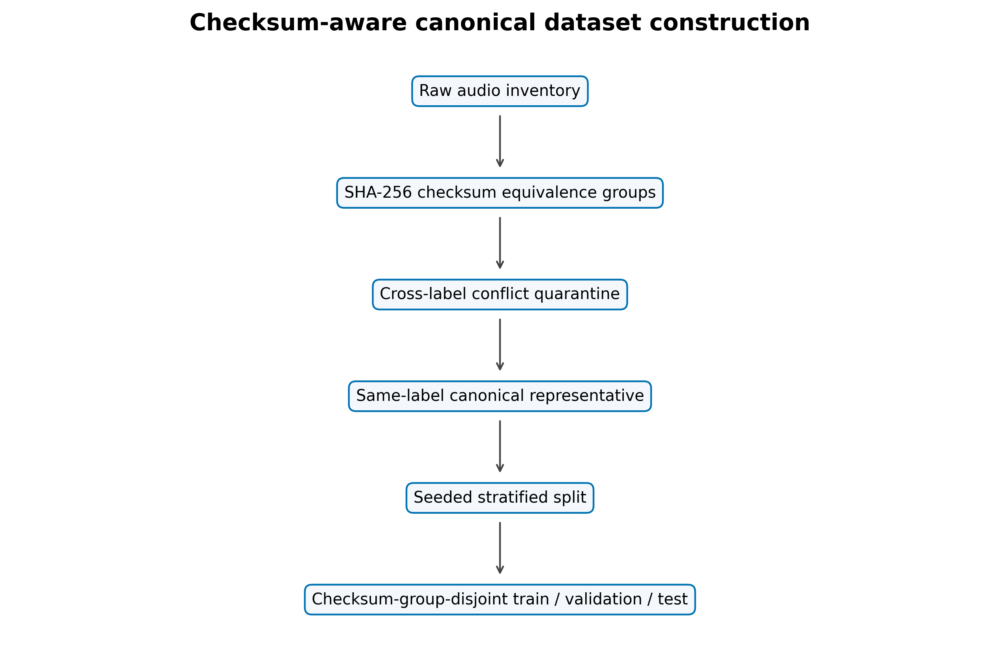
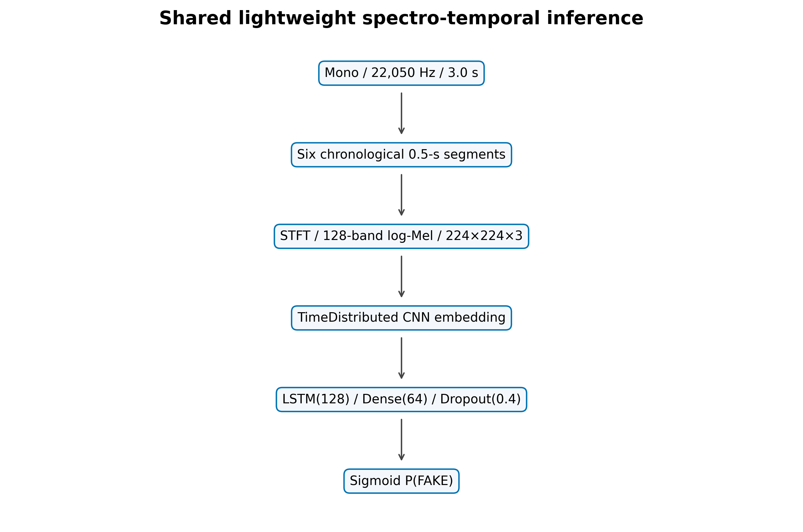
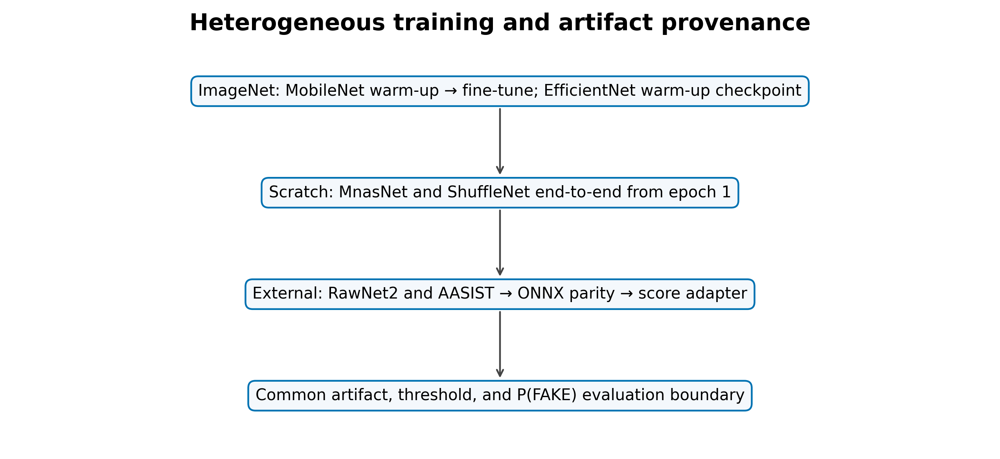
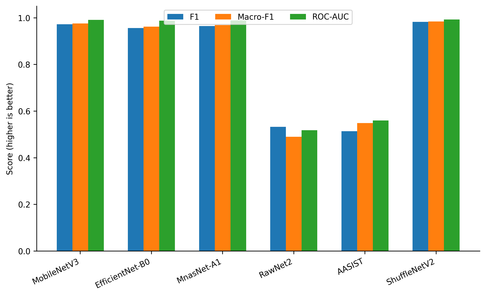
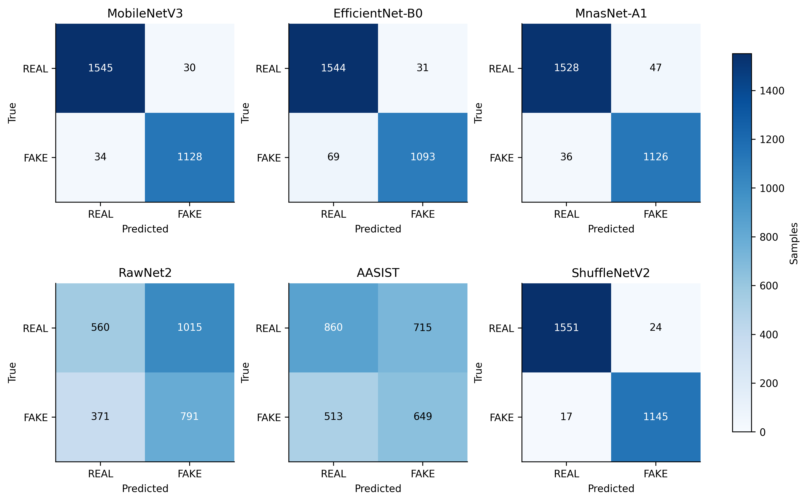
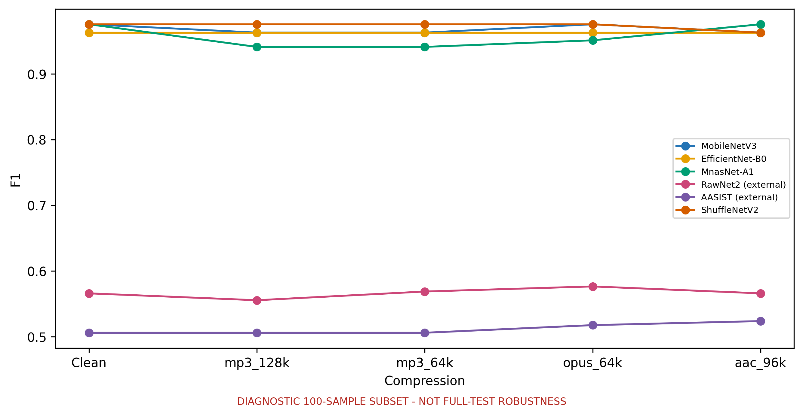
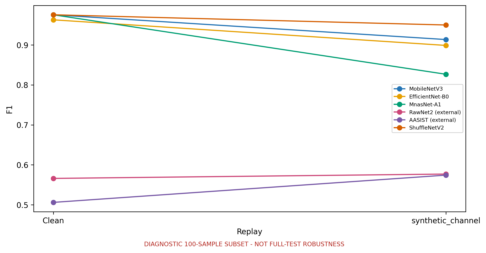
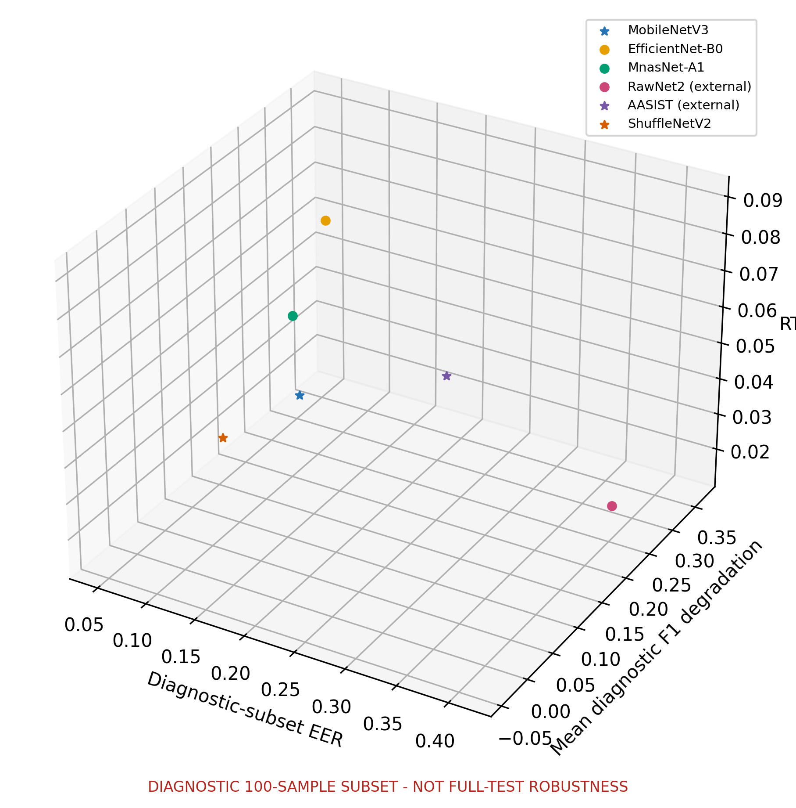

# LAVA: A Lightweight Benchmarking Framework for Robust and Real-Time Deepfake Voice Detection

## Abstract

Deepfake-voice detectors are commonly compared across different data partitions, score conventions, preprocessing pipelines, and runtime protocols, making accuracy–efficiency claims difficult to interpret. This paper presents LAVA, a registry-based framework that evaluates heterogeneous detectors through a common label, score, integrity, robustness, and timing contract while preserving their native architectures. The current study evaluates six artifacts: four LAVA-trained Mel-sequence detectors—MobileNetV3Small-LSTM, ShuffleNetV2-1.0x-LSTM, EfficientNet-B0-LSTM, and MnasNet-A1-LSTM—and externally pretrained RawNet2 and AASIST references. SHA-256 grouping quarantined 30 byte-identical cross-label files and prevented same-checksum leakage. Clean evaluation used all 2,737 canonical test recordings. ShuffleNetV2 achieved the strongest clean result (F1 0.9824, ROC-AUC 0.9929, EER 1.46%), while MobileNetV3 provided the lowest measured end-to-end latency (43.8 ms). ShuffleNetV2 required 62.5 ms (RTF 0.0208) on the same single-thread desktop CPU. Robustness was evaluated diagnostically—not as a full-test result—on a fixed stratified 100-recording subset under seeded white noise, four codec round trips, and one simulated replay channel. ShuffleNet's mean F1 degradation was 0.1623 across nine conditions; low-SNR noise remained the dominant failure mode. The diagnostic three-objective Pareto set contained MobileNetV3, ShuffleNetV2, and AASIST. The reference checkpoints performed substantially worse under the present clean dataset and adapter protocol, but provenance and input-contract differences preclude an architecture-only interpretation. These findings support reproducible deployment-oriented comparison, but not physical-replay, unseen-dataset, edge-device, multi-seed, or full-test robustness claims.

**Keywords—** deepfake voice detection; audio anti-spoofing; lightweight deep learning; robustness; real-time factor; Pareto analysis.

## 1. Introduction

### 1.1 Background and motivation

Synthetic and converted speech challenge both human listeners and automatic speaker-verification systems. Community benchmarks such as ASVspoof formalized logical- and physical-access threat models [1–5], while WaveFake broadened publicly available generated-audio resources [6]. The resulting literature includes engineered acoustic features, raw-waveform networks, graph-attention systems, and compact convolutional backbones. Reported quality alone, however, does not answer whether a detector is robust to channel distortion or usable under a constrained runtime.

Comparison is especially fragile when systems encode opposite class orders, expose logits rather than comparable probabilities, use incompatible durations, or time only the neural forward pass for one model and the complete pipeline for another. Dataset duplication provides a second failure mode: byte-identical audio can inflate held-out performance when copies enter different splits. LAVA addresses these experimental-interface problems rather than asserting that one internal architecture fits every detector.

### 1.2 Research gap

RawNet2 directly models waveforms [9], AASIST preserves interacting spectral and temporal graph representations [10], and mobile CNN families were designed around different efficiency principles [20–25]. Forcing these systems into one topology would destroy useful architectural diversity. Conversely, evaluating them without a common contract confounds architecture, score semantics, data integrity, and measurement policy. A reproducible framework must therefore standardize the evaluation boundary while retaining native computation inside that boundary.

The present repository provides such a boundary for four locally trained lightweight artifacts with unequal initialization histories and two externally pretrained references. Clean evaluation is complete for all six; robustness has been completed only on a fixed diagnostic subset. This paper reports that mixed scope explicitly.

### 1.3 Research questions

**RQ1:** How competitive are the four lightweight temporal CNN detectors relative to two externally pretrained anti-spoofing systems under the common clean LAVA evaluation protocol?

**RQ2:** How does detection performance change under the noise, codec, and simulated-replay conditions actually executed in the current diagnostic evaluation?

**RQ3:** Which evaluated detectors are non-dominated when EER, mean robustness degradation, and end-to-end RTF are considered jointly within the completed diagnostic scope?

### 1.4 Contributions

This work contributes: (1) a framework-neutral `P(FAKE)` contract across TensorFlow and externally trained PyTorch/ONNX detectors; (2) a checksum-aware integrity protocol that quarantines cross-label conflicts and prevents byte-identical split leakage; (3) an artifact-traceable six-detector clean benchmark and fixed-subset robustness diagnostic; (4) a common CPU protocol separating preprocessing, model-only, and end-to-end latency; and (5) measured error, bootstrap, agreement, and Pareto analyses without an arbitrary weighted ranking.

## 2. Related Work

### 2.1 Benchmarks and evaluation metrics

ASVspoof established common corpora and protocols for synthesis, conversion, and replay countermeasures across its 2015, 2017, 2019, and 2021 editions [1–4]. The tandem detection cost function subsequently connected countermeasure errors to an automatic-speaker-verification operating scenario [5]. LAVA uses EER as a threshold-independent discrimination summary, but it does not claim compatibility with an ASV operating prior and therefore does not report t-DCF. WaveFake broadened access to generated speech [6], while recent surveys organize the expanding landscape of representations, datasets, and generalization problems [7,8]. None of those corpus statistics are reused as statistics of the internal LAVA manifest.

### 2.2 Native anti-spoofing architectures

RawNet2 performs end-to-end anti-spoofing from waveform samples [9]. AASIST adds integrated spectral and temporal graph attention [10], building on the broader graph-attention mechanism [27]. LCNN systems demonstrate the continuing relevance of explicitly constructed time-frequency features [11]. LAVA preserves the internal form of each reference system: the RawNet2 adapter does not construct Mel images, and the AASIST adapter does not replace graph reasoning with an LSTM. Its intervention is limited to input adaptation, strict checkpoint loading, export, and common score semantics.

### 2.3 Self-supervision and generalization

Self-supervised speech encoders such as wav2vec 2.0, HuBERT, and WavLM provide transferable representations [28–30]. Their use in anti-spoofing with augmentation has yielded strong benchmark performance [12], and frozen self-supervised representations can improve calibration and cross-dataset behavior [16]. LAVA does not evaluate these large encoders in the current six-detector set; they instead define an important future extension point.

Generalization remains a distinct question from in-domain accuracy. Uniform re-evaluation has revealed substantial degradation outside familiar conditions [13]; attack-agnostic data construction [14], decomposition of domain shift [15], explicit cross-domain corpora [17], non-semantic representations [18], and multilingual cross-domain benchmarks [19] all reinforce that conclusion. The present repository has no executed external-corpus evaluation. Consequently, LAVA reports only its canonical held-out split and marks cross-domain performance `NOT_AVAILABLE`.

### 2.4 Lightweight convolutional backbones

MobileNetV2 introduced inverted residuals and linear bottlenecks [21], and MobileNetV3 combined these ideas with hardware-aware search [20]. ShuffleNet introduced group convolution and channel shuffling [22]; ShuffleNetV2 emphasized practical memory-access and parallelism criteria rather than FLOPs alone [23]. EfficientNet jointly scales depth, width, and image resolution [24], whereas MnasNet explicitly incorporated measured mobile latency into architecture search [25]. LAVA reuses these designs only as segment encoders. Their published ImageNet or phone measurements are not treated as evidence for LAVA audio accuracy or runtime.

### 2.5 Robustness and deployment measurement

Codec, channel, noise, and unseen-generator shifts may redistribute detector scores even when linguistic content is preserved. Prior generalization work [13–19] motivates matched-condition evaluation, while the ASVspoof replay track illustrates the difficulty of variable acoustic paths [2]. Runtime likewise depends on backend, tensor shape, memory traffic, thread policy, and timing boundary. LAVA therefore measures the executed pipeline rather than inferring latency from parameter count. Its real-time factor is an offline ratio; it is not evidence of causal streaming or edge-device validation.

### 2.6 Statistical and multi-objective analysis

Test-set uncertainty is estimated with the non-parametric bootstrap [31]. Paired correctness differences use McNemar's exact test [32], with Holm correction across the 15 detector pairs [33]. Pareto analysis retains distinct detection, robustness, and runtime objectives instead of collapsing them into an arbitrarily weighted score. This distinction is important because a model can be non-dominated for an extreme objective while remaining unattractive under absolute detection quality.

**Table 1. Positioning of representative related work. A dash means that the cited work was not designed to report that dimension under a unified detector-comparison protocol.**

| Work | Detector or resource | Robustness/cross-domain focus | Measured efficiency | Relation to LAVA |
|---|---|---|---|---|
| ASVspoof series [1–5] | community benchmark | logical/physical/deepfake protocols | not the primary focus | motivates common protocols and EER |
| WaveFake [6] | multi-generator dataset | dataset diversity | no | candidate future external corpus |
| RawNet2 [9] | raw-waveform network | anti-spoofing benchmark | limited | external reference checkpoint |
| AASIST [10] | spectro-temporal graph network | anti-spoofing benchmark | limited | external reference checkpoint |
| wav2vec anti-spoofing [12] | self-supervised encoder | augmentation/generalization | no unified CPU protocol | future detector family |
| Müller et al. [13,15] | uniform/cross-domain analyses | central | partial | motivates conservative scope |
| Kawa et al. [14] | attack-agnostic data/LCNN | central | limited | motivates data provenance |
| CD-ADD/XMAD-Bench [17,19] | cross-domain datasets | central | not unified with LAVA | future external evaluation |
| LAVA (this work) | six heterogeneous detectors | clean plus diagnostic noise/codec/replay | size, RSS, latency, throughput, RTF | unified score, artifact, and analysis contract |

## 3. Methodology

### 3.1 LAVA framework overview

LAVA is a benchmarking framework rather than a seventh detector. We represent an executed benchmark as

$$\mathcal{B}=\{\mathcal{D},\mathcal{M},\mathcal{C},\mathcal{E},\mathcal{A}\},$$

where $\mathcal{D}$ is the canonical data and integrity protocol, $\mathcal{M}$ is the registered detector set, $\mathcal{C}$ is the set of executed clean and stress conditions, $\mathcal{E}$ contains detection and resource metrics, and $\mathcal{A}$ contains statistical, agreement, error-overlap, and Pareto analyses. This factorization prevents a planned condition from silently becoming an executed result.

Four software layers implement this abstraction. The data/integrity layer constructs immutable sample identities and splits. The model/adapter layer retains each native architecture while exposing a common prediction API. The benchmark layer performs clean, robustness, and isolated runtime measurements. The analysis layer joins stored scores by sample ID, calculates uncertainty and agreement, and produces tables and figures. Detector specifications declare framework, input type, duration, artifact paths, and provenance. Adapters expose loading, score prediction, parameter count, and model size. The benchmark seals model, metadata, threshold, manifest, and inference-source hashes before execution; report generation recomputes aggregates from the sealed per-sample files.

The execution pipeline (Fig. 2) verifies the canonical manifest, loads each artifact in an isolated sequential worker, evaluates unchanged scores, generates shared stress audio, measures runtime, and derives tables and figures programmatically.

### 3.2 Dataset and integrity protocol

The repository dataset is an internal binary collection stored under `data/REAL` and `data/FAKE`; its speaker, source, generator, parent-recording, and dataset identifiers are all `UNKNOWN`. Accordingly, LAVA makes no ASVspoof-sized, speaker-disjoint, source-disjoint, generator-disjoint, or cross-dataset claim for this collection.

Inventory scanned 18,722 files: 10,550 labeled REAL and 8,172 labeled FAKE. SHA-256 analysis found 435 duplicate groups, 476 redundant duplicate files, and 14 cross-label checksum groups involving 30 files. Every cross-label member was quarantined at manifest level. For a same-label checksum group, the lexicographically first path was retained as the canonical representative and other copies were excluded. The final manifest contains 18,232 recordings (10,493 REAL; 7,739 FAKE), split deterministically with seed 42 into 12,762 training, 2,733 validation, and 2,737 test recordings. The supported claim is therefore **checksum-group-disjoint only**. The manifest hash is `8b55591d58d3658b8cafe0e77b6ebdedbaa67be2e339730a7276fe9b10958df9`.

For audio file $x_i$, let $h(x_i)=\operatorname{SHA256}(x_i)$. Byte-level duplicate equivalence is

$$x_i\sim x_j\iff h(x_i)=h(x_j).$$

Let $G_{train}$, $G_{val}$, and $G_{test}$ denote the checksum-equivalence groups assigned to each split. The integrity assertion checked by the manifest utility is

$$G_{train}\cap G_{val}=G_{train}\cap G_{test}=G_{val}\cap G_{test}=\varnothing.$$

This guarantee is deliberately narrower than speaker independence: the manifest has no speaker identifiers with which to test speaker overlap. Figure 3 shows the actual quarantine and canonicalization sequence.

**Table 2. Dataset-integrity inventory derived from `manifest_metadata.json`.**

| Quantity | Value |
|---|---:|
| Scanned / included / excluded files | 18,722 / 18,232 / 490 |
| Included REAL / FAKE | 10,493 / 7,739 |
| Duplicate groups / redundant files | 435 / 476 |
| Cross-label groups / files quarantined | 14 / 30 |
| Split seed | 42 |
| Supported independence claim | checksum-group-disjoint only |

**Table 3. Canonical splits.**

| Split | Samples | Share |
|---|---:|---:|
| Train | 12,762 | 70.0% |
| Validation | 2,733 | 15.0% |
| Test | 2,737 | 15.0% |

### 3.3 Standardized audio preprocessing

For the lightweight family, audio is decoded with SoundFile where supported, converted to mono by channel averaging, resampled with polyphase filtering to 22,050 Hz, and zero-padded or truncated to 3.0 s (66,150 samples). The signal is divided chronologically into six non-overlapping 0.5-s segments. Each segment uses a Hann-window STFT with `n_fft=2048` and hop length 512. A 128-band HTK-style triangular Mel bank spans 20–8,000 Hz. Power is converted to decibels relative to the segment maximum and clipped to an 80-dB range. Linear mapping yields [0,255], bilinear resizing yields 224×224, and channel replication yields an RGB tensor. One recording therefore has shape `6×224×224×3` in float32.

For segment $t$, the implemented short-time Fourier transform corresponds to

$$X_t(m,k)=\sum_{n=0}^{N-1}x_t[n+mH]w[n]e^{-j2\pi kn/N},$$

with $N=2048$, $H=512$, and a Hann window. The power spectrum is projected through triangular HTK Mel filters $H_r(k)$,

$$S_{mel,t}(m,r)=\sum_k |X_t(m,k)|^2H_r(k),$$

floored at $10^{-10}$, and mapped relative to the segment maximum as $S_{dB}=10\log_{10}S_{mel}-\max(10\log_{10}S_{mel})$. Values below $-80$ dB are clipped. This exact implementation uses SciPy STFT and an explicit Mel bank; librosa is only a decoding fallback [34]. Figure 4 clarifies that chronological order is retained through the recurrent head.

Reference adapters instead load mono 16-kHz waveforms of 64,600 samples (4.0375 s). The retained production adapters use polyphase resampling and prefix/zero-padding. The reference repositories use librosa and repetition padding for short files. This documented deviation was not changed after test inspection. Native-checkpoint versus ONNX parity uses identical adapter tensors and therefore verifies export fidelity, not equivalence to the original publication pipeline.

### 3.4 Lightweight temporal detector family

For the four image-backbone systems, a recording is a sequence $\mathbf{X}=\{X_1,\ldots,X_6\}$. A shared backbone $f_\theta$ produces $\mathbf{z}_t=f_\theta(X_t)$ independently at every time step. The recurrent representation is $\mathbf{h}=\operatorname{LSTM}(\mathbf{z}_1,\ldots,\mathbf{z}_6)$, after which the actual head computes

$$p_{fake}=\sigma\left(W_2\operatorname{Dropout}_{0.4}(\operatorname{ReLU}(W_1\mathbf{h}+b_1))+b_2\right).$$

The LSTM has 128 units and the hidden dense layer has 64 units. The time-distributed construction shares backbone weights across segments, so it does not multiply the parameter count by six. It does multiply per-recording convolutional work, which is why measured runtime remains necessary.

### 3.5 MobileNetV3Small-LSTM

MobileNetV3Small combines inverted residual blocks, depthwise convolutions, squeeze-and-excitation, and hardware-aware nonlinearities [20,21]. In LAVA it emits a 576-dimensional segment embedding. The deployment artifact has 1,308,401 Keras parameters and uses ImageNet initialization. Training followed frozen-backbone warm-up and lower-rate partial fine-tuning; BatchNormalization remained frozen during fine-tuning. This artifact therefore tests a transfer-learning path, not a scratch-controlled comparison.

### 3.6 ShuffleNetV2-1.0x-LSTM

ShuffleNetV2 uses stride-one channel splitting: one branch is preserved while the second applies pointwise, depthwise, and pointwise convolutions, after which concatenation and channel shuffle exchange information [22,23]. Stride-two units transform both branches while reducing spatial resolution. The LAVA backbone produces a 1,024-dimensional segment embedding and the complete temporal model has 1,868,441 parameters. It was initialized from scratch and trained end-to-end from epoch 1, with all 56 BatchNormalization layers trainable. Adam began at $3\times10^{-4}$; early stopping ended the run at epoch 28 and restored the minimum-validation-loss checkpoint from epoch 16. Its validation-selected threshold is 0.12.

### 3.7 MnasNet-A1-LSTM

MnasNet-A1 originates from platform-aware neural architecture search [25]. Its inverted residual stages provide a 1,280-dimensional embedding. The resulting LAVA model has 3,369,255 parameters and was initialized from scratch. Backbone, 49 BatchNormalization layers, LSTM, and head were jointly trainable from epoch 1. Adam began at $10^{-4}$; training stopped at epoch 39 and restored epoch 27. The deployed validation-F1 threshold is 0.90. These facts are taken from lifecycle and deployment metadata rather than inferred from the filename.

### 3.8 EfficientNet-B0-LSTM

EfficientNet-B0 uses mobile inverted bottlenecks, squeeze-and-excitation, and compound scaling [24]. The LAVA adapter exposes a 1,280-dimensional segment embedding, and the temporal classifier contains 4,779,300 parameters. Its backbone is ImageNet-initialized. The available deployment bundle is specifically the best warm-up checkpoint (epoch 47, validation loss 0.1698); it is not represented as a completed fine-tuning lifecycle. This distinction matters when comparing it with fully trained lightweight artifacts.

### 3.9 RawNet2 reference detector

RawNet2 receives 64,600 samples at 16 kHz (4.0375 s), applies a Sinc-style filter bank, residual temporal blocks, channel attention, a GRU, and a classifier [9,26]. LAVA strictly loads the external checkpoint and exports a self-contained ONNX graph for production evaluation. The adapter takes the spoof posterior at the checkpoint-defined class index and exposes it as $P(FAKE)$. The 17,621,410-parameter checkpoint was not trained by the LAVA trainer.

### 3.10 AASIST reference detector

AASIST combines a raw-waveform front end with a two-dimensional encoder, spectral and temporal graphs, graph-attention layers, heterogeneous interaction, master nodes, graph pooling, and a final classifier [10,27]. LAVA preserves these operations and maps the native spoof logit/posterior to $P(FAKE)$. The strict native load contains 297,866 parameters; the ONNX export is used for the common runtime. As with RawNet2, this is an externally pretrained reference checkpoint.

### 3.11 Detector specification

**Table 4. Detector configuration and artifact provenance.**

| Detector | Category | Runtime | Input/duration | Architecture and temporal mechanism | Parameters | Artifact/training provenance |
|---|---|---|---|---|---:|---|
| MobileNetV3Small-LSTM | lightweight | TensorFlow 2.15 | Mel sequence, 3.0 s | TimeDistributed MobileNetV3Small (576-D), LSTM(128), dense head | 1,308,401 | LAVA-trained; ImageNet initialization |
| EfficientNet-B0-LSTM | lightweight | TensorFlow 2.15 | Mel sequence, 3.0 s | TimeDistributed EfficientNet-B0 (1280-D), LSTM(128), dense head | 4,779,300 | LAVA-trained; ImageNet; best available warm-up checkpoint |
| MnasNet-A1-LSTM | lightweight | TensorFlow 2.15 | Mel sequence, 3.0 s | TimeDistributed MnasNet-A1 (1280-D), LSTM(128), dense head | 3,369,255 | LAVA-trained end-to-end from scratch; early-stopped best |
| ShuffleNetV2-1.0x-LSTM | lightweight | TensorFlow 2.15 | Mel sequence, 3.0 s | TimeDistributed ShuffleNetV2 (1024-D), LSTM(128), dense head | 1,868,441 | LAVA-trained end-to-end from scratch; early-stopped best |
| RawNet2 | reference | ONNX Runtime export of PyTorch | waveform, 4.0375 s | Sinc/residual/attention/GRU | 17,621,410 | external checkpoint; reference README associates it with ASVspoof 2019 LA |
| AASIST | reference | ONNX Runtime export of PyTorch | waveform, 4.0375 s | Sinc/2-D encoder/spectral-temporal heterogeneous graph attention/readout | 297,866 | external checkpoint; reference README associates it with ASVspoof 2019 LA |

Parameter counts come from loaded Keras models for lightweight detectors and strictly loaded native PyTorch parameters for reference detectors. The conventions differ because Keras counts non-trainable BatchNorm state whereas the native count excludes buffers.

Backbone embedding width is not artificially equalized. Parameter counts come from loaded Keras models for the lightweight detectors and strictly loaded native PyTorch tensors for reference detectors; Keras includes non-trainable BatchNormalization state whereas the native reference count excludes buffers.

### 3.12 Training and artifact provenance

MobileNetV3 used ImageNet initialization and the repository's two-stage lifecycle: frozen-backbone head warm-up followed by lower-rate partial fine-tuning with BatchNorm frozen. EfficientNet also uses ImageNet initialization, but the available deployment is explicitly the best warm-up checkpoint (warm-up epoch 47, validation loss 0.1698), not a completed global-best fine-tuning lifecycle. MnasNet was trained from scratch, end-to-end from epoch 1; its deployed artifact is the best restored epoch 27 from an early-stopped 39-epoch run. ShuffleNet was likewise trained end-to-end from scratch with all 56 BatchNormalization layers trainable; the deployed artifact is restored from best epoch 16 of an early-stopped 28-epoch run. Its recorded Adam learning rate is `3e-4`. Thus evaluation is shared, but initialization and optimization are not identical.

RawNet2 and AASIST were not trained by the LAVA trainer. Their source `.pth` files were strictly loaded in PyTorch and exported to self-contained ONNX graphs. Six real sample tensors produced maximum native-versus-ONNX `P(FAKE)` differences of `4.11×10⁻⁶` for RawNet2 and `5.96×10⁻⁸` for AASIST. These tests establish numerical adapter/export parity, not equal training provenance.

**Table 5. Training, selection, and threshold provenance.**

| Detector | Initialization / training mode | Initial LR | BN policy | Selected artifact | Threshold source |
|---|---|---:|---|---|---|
| MobileNetV3 | ImageNet; warm-up then partial fine-tune | $10^{-4}$ | frozen in fine-tune | completed local lifecycle | validation FAKE-F1, 0.82 |
| EfficientNet-B0 | ImageNet; warm-up | $10^{-4}$ | frozen backbone | best warm-up epoch 47 | validation FAKE-F1, 0.90 |
| MnasNet-A1 | scratch; full end-to-end | $10^{-4}$ | 49/49 trainable | restored epoch 27 of 39 | validation FAKE-F1, 0.90 |
| ShuffleNetV2 | scratch; full end-to-end | $3\times10^{-4}$ | 56/56 trainable | restored epoch 16 of 28 | validation FAKE-F1, 0.12 |
| RawNet2 | external checkpoint; no LAVA training | N/A | native | strict load + ONNX export | uncalibrated default, 0.50 |
| AASIST | external checkpoint; no LAVA training | N/A | native | strict load + ONNX export | uncalibrated default, 0.50 |

### 3.13 Score semantics and threshold calibration

LAVA fixes REAL=0 and FAKE=1. Every adapter returns a bounded score (p=P(FAKE)), and

$$
\hat y=\begin{cases}1,&p\ge\tau,\\0,&p<\tau.\end{cases}\tag{1}
$$

The lightweight thresholds—0.82 for MobileNet, 0.90 for EfficientNet and MnasNet, and 0.12 for ShuffleNet—were selected only on validation data as $\tau^*=\arg\max_{\tau}F1_{val}(\tau)$ over the configured search grid. RawNet2 and AASIST retain uncalibrated default thresholds of 0.5. Test labels never choose weights or thresholds. Scores are not claimed to be calibrated real-world probabilities; a label selected by a non-0.5 threshold must not be interpreted as the larger of two calibrated posteriors.

### 3.14 Clean evaluation protocol

Clean evaluation uses all 2,737 test samples (1,575 REAL, 1,162 FAKE). For FAKE as the positive class,

$$Precision=\frac{TP}{TP+FP},\quad Recall=\frac{TP}{TP+FN},\quad F1=\frac{2PR}{P+R}.\tag{2}$$

In addition, $Accuracy=(TP+TN)/(TP+TN+FP+FN)$ and $F1_{macro}=\frac{1}{2}(F1_{REAL}+F1_{FAKE})$. Binary cross-entropy used by the locally trained sigmoid classifiers is

$$\mathcal{L}_{BCE}=-\frac{1}{N}\sum_i[y_i\log p_i+(1-y_i)\log(1-p_i)].$$

ROC-AUC is computed from raw (P(FAKE)), never thresholded labels. For a threshold (\tau),

$$FAR(\tau)=\frac{FP}{FP+TN},\qquad FRR(\tau)=\frac{FN}{FN+TP}.\tag{3}$$

The implementation finds the first sign change of (FAR-FRR), linearly interpolates, and reports

$$EER=\frac{FAR(\tau^*)+FRR(\tau^*)}{2},\quad FAR(\tau^*)\simeq FRR(\tau^*).\tag{4}$$

### 3.15 Background-noise stress protocol

For signal power $P_s$ and target SNR $r$, the required noise power is $P_n=P_s/10^{r/10}$. A sample-specific seed is derived from the first 16 hexadecimal characters of its SHA-256 identity, making the generated white-noise waveform reproducible. Conditions are 20, 10, 5, and 0 dB. Stress WAV files are written once in float32 and shared by all six adapters; no detector receives an independently sampled perturbation.

### 3.16 Compression stress protocol

Four FFmpeg round trips were executed: MP3 at 128 and 64 kb/s, Opus at 64 kb/s, and AAC at 96 kb/s. Source waveforms are first materialized as PCM16, encoded, decoded, and then consumed through the ordinary detector adapter. The same encoded files and condition manifest are reused across models. Codec-library version is not sealed in the present result metadata and is therefore reported as `NOT_MEASURED` rather than guessed.

### 3.17 Simulated replay protocol

The single replay condition is explicitly simulated. It applies a direct path and taps at 17, 43, and 89 ms with gains 0.45, 0.25, and 0.12 after the unit direct tap, divides the result by 1.82, and applies a causal fourth-order Butterworth band-pass from 100 to 3,800 Hz. In compact notation, $y(t)=(x*h)(t)$ for the fixed synthetic impulse response $h$, followed by fixed channel filtering. No room response was measured and no loudspeaker/microphone recording was made.

### 3.18 Robustness scope and degradation

Runtime estimates made full-test stress evaluation impractical in the current execution. Before observing model errors, a deterministic stratified subset of 100 test recordings (58 REAL, 42 FAKE; seed 42) was selected. The clean baseline for every degradation is derived from exactly those IDs. All diagnostic figures carry a warning and are stored separately from full-test results.

Noise uses seeded additive white Gaussian noise at 20, 10, 5, and 0 dB, with exact whole-prefix RMS SNR and float32 WAV storage. Compression uses FFmpeg round trips through MP3 at 128 and 64 kb/s, Opus at 64 kb/s, and AAC at 96 kb/s; PCM16 conversion is part of the condition. Simulated replay applies direct and delayed taps at 0, 17, 43, and 89 ms with gains 1, 0.45, 0.25, and 0.12, fixed normalization, and a causal fourth-order 100–3,800-Hz Butterworth band-pass. It is not physical replay or a measured room impulse response.

For higher-is-better F1, (\Delta F1=F1_{clean}-F1_{stress}); lower is better. The overall diagnostic degradation is the arithmetic mean across all nine individual conditions, not a weighted category score. Negative degradation denotes an improvement on this small subset and should not be over-interpreted. No unseen/cross-dataset result exists.

Analogously, $\Delta AUC_c=AUC_{clean}-AUC_c$ and $\Delta EER_c=EER_c-EER_{clean}$. The reported aggregate uses F1 only: $\overline{\Delta F1}=K^{-1}\sum_{k=1}^{K}\Delta F1_k$ with $K=9$. Full-test robustness, physical replay, and unseen evaluation remain `NOT_RUN`, `NOT_AVAILABLE`, and `NOT_AVAILABLE`, respectively.

### 3.19 Computational efficiency protocol

Each model runs in a sequential isolated process on the same Windows desktop CPU, float32, batch size one, and one computational thread per backend. The sealed metadata reports Windows `10.0.26200` and `AMD64 Family 25 Model 68 Stepping 1, AuthenticAMD`; it does not record a commercial CPU name or installed RAM capacity, so neither is invented here. No accelerator is used. Lightweight models execute with TensorFlow 2.15, while exported reference models execute with ONNX Runtime 1.17.3. Ten warm-up runs precede 50 timed repetitions. The runner reports mean, median, standard deviation, P95, preprocessing, model-only and end-to-end time, throughput, load time, and process RSS sampled every 20 ms. Interpreter startup and graph tracing are excluded from warm timings. RSS is whole-process memory, not model-only peak allocation.

$$\bar T=\frac{1}{N}\sum_iT_i,\quad \sigma_T=\sqrt{\frac{1}{N-1}\sum_i(T_i-\bar T)^2},$$

$$RTF=\frac{T_{processing}}{T_{audio}},\qquad Q=\frac{N_{clips}}{T_{total}},\qquad S_{MiB}=\frac{bytes}{2^{20}}.\tag{5}$$

RTF below one means offline processing completed faster than clip duration; it does not demonstrate causal streaming. No edge hardware was tested.

### 3.20 Statistical uncertainty and paired tests

The six full-test score files are joined by sample ID. One thousand stratified bootstrap replicates (seed 42) resample REAL and FAKE indices independently and compute percentile 95% intervals for F1, ROC-AUC, and EER [31]. Correctness discordances for each detector pair form counts $n_{01}$ and $n_{10}$ for the exact two-sided McNemar test [32]. Holm's sequential procedure controls family-wise error over all 15 pairs [33]. Paired bootstrap intervals for $F1_A-F1_B$ preserve within-sample dependence. These analyses quantify uncertainty conditional on existing checkpoints and this test sample; they are not multi-seed training uncertainty.

### 3.21 Error and agreement analysis

Pairwise agreement is the fraction of sample IDs receiving identical thresholded decisions. The analysis also counts unanimous correctness, unanimous failure, lightweight-reference disagreements, and detector-specific errors. High-confidence categories are retained in machine-readable outputs, but because reference scores are not probability-calibrated, they are not interpreted as calibrated risk.

### 3.22 Pareto multi-objective analysis

The diagnostic Pareto objectives minimize clean-subset EER, mean F1 degradation, and end-to-end RTF. Model (A) dominates (B) iff

$$f_i(A)\le f_i(B)\ \forall i,\qquad \exists j:f_j(A)<f_j(B).\tag{6}$$

The non-dominated set is $\mathcal{P}=\{m\in\mathcal{M}:\nexists m'\text{ such that }m'\prec m\}$. No weighted composite score is used. Because robustness is subset diagnostic, this frontier is exploratory; the official full-test frontier remains `NOT_RUN`.

### 3.23 Reproducibility and artifact management

Every deployable bundle is resolved through the detector registry and paired with metadata and threshold artifacts. The clean benchmark stores one row per canonical test sample, including `sample_id`, true label, raw $P(FAKE)$, threshold, prediction, and correctness. LAVA-5 outputs are retained as immutable history; the incremental six-model process evaluated only ShuffleNet and then recomputed aggregates whose mathematics depends on model count. The publication tables are generated from stored CSV/JSON by `scripts/finalize_publication_assets.py`, which imports no detector loader and therefore cannot trigger training or inference.

## 4. Results

### 4.1 Experimental artifact coverage

All six artifacts passed loading, bounded-score, two-class probe, artifact-hash, and public-adapter parity checks. The native checkpoint-to-ONNX parity checks passed for both external references. ShuffleNet's converted TensorFlow 2.15 artifact preserved source scores within `1.75×10^-10`, loaded with 1,868,441 parameters, and matched the canonical training-manifest hash.

### 4.2 RQ1—clean detection performance

**Table 6. Full canonical-test clean performance. Arrows indicate the desirable direction.**

| Model | Accuracy | Precision | Recall | F1 | Macro F1 | ROC-AUC | EER | TN/FP/FN/TP |
|---|---:|---:|---:|---:|---:|---:|---:|---|
| MobileNetV3-LSTM | 0.9766 | 0.9741 | 0.9707 | **0.9724** | **0.9761** | **0.9911** | **0.0250** | 1545/30/34/1128 |
| EfficientNet-B0-LSTM | 0.9635 | 0.9724 | 0.9406 | 0.9563 | 0.9624 | 0.9877 | 0.0400 | 1544/31/69/1093 |
| MnasNet-A1-LSTM | 0.9697 | 0.9599 | 0.9690 | 0.9645 | 0.9690 | 0.9886 | 0.0310 | 1528/47/36/1126 |
| ShuffleNetV2-LSTM | **0.9850** | **0.9795** | **0.9854** | **0.9824** | **0.9847** | **0.9929** | **0.0146** | 1551/24/17/1145 |
| RawNet2 external | 0.4936 | 0.4380 | 0.6807 | 0.5330 | 0.4900 | 0.5178 | 0.4813 | 560/1015/371/791 |
| AASIST external | 0.5513 | 0.4758 | 0.5585 | 0.5139 | 0.5487 | 0.5597 | 0.4463 | 860/715/513/649 |

The four lightweight artifacts substantially outperformed the two external checkpoints under this specific test and adapter contract. ShuffleNet led every reported clean aggregate: F1 0.9824, macro-F1 0.9847, AUC 0.9929, and EER 0.0146. MobileNet was second on F1 (0.9724) and AUC (0.9911); MnasNet followed on F1 (0.9645), while EfficientNet's available warm-up checkpoint reached 0.9563. RawNet2 and AASIST produced AUCs of 0.5178 and 0.5597. This observation is not a controlled architecture ranking because initialization, training provenance, thresholds, durations, preprocessing, and adaptation differ.

### 4.3 Class-wise error characteristics

**Table 7. Class-wise precision, recall, and F1 on the full canonical test split.**

| Model | REAL P | REAL R | REAL F1 | FAKE P | FAKE R | FAKE F1 |
|---|---:|---:|---:|---:|---:|---:|
| MobileNetV3 | 0.9785 | 0.9810 | 0.9797 | 0.9741 | 0.9707 | 0.9724 |
| EfficientNet-B0 | 0.9572 | 0.9803 | 0.9686 | 0.9724 | 0.9406 | 0.9563 |
| MnasNet-A1 | 0.9770 | 0.9702 | 0.9736 | 0.9599 | 0.9690 | 0.9645 |
| ShuffleNetV2 | 0.9892 | 0.9848 | 0.9870 | 0.9795 | 0.9854 | 0.9824 |
| RawNet2 | 0.6015 | 0.3556 | 0.4469 | 0.4380 | 0.6807 | 0.5330 |
| AASIST | 0.6264 | 0.5460 | 0.5834 | 0.4758 | 0.5585 | 0.5139 |

ShuffleNet made 24 false-positive and 17 false-negative decisions, the smallest counts among the six. EfficientNet's recall gap is concentrated on FAKE samples (69 false negatives), whereas MnasNet trades more false positives (47) for fewer false negatives (36). RawNet2 labeled many REAL recordings as FAKE (1,015 false positives), consistent with an external threshold and a shifted input/domain contract. The six confusion matrices in Fig. 7 retain raw counts, avoiding the visual distortion that would result from independently normalized color scales.

### 4.4 ROC and DET analysis

The full-score ROC and DET curves in Figs. 8 and 9 show strong separation for all four lightweight models and near-diagonal behavior for the external references. Because AUC and EER are computed from raw scores, these conclusions do not depend on the deployed thresholds. The close AUC values among the lightweight group should not be described as identical performance: bootstrap intervals overlap, but paired thresholded correctness can still differ.

### 4.5 RQ2—diagnostic noise robustness

**Table 8. Matched 100-sample diagnostic robustness. Values are mean F1 degradation; lower is better.**

| Model | Subset clean F1 | Noise ΔF1 | Codec ΔF1 | Simulated replay ΔF1 | Mean over 9 conditions |
|---|---:|---:|---:|---:|---:|
| MobileNetV3-LSTM | 0.9756 | 0.6722 | 0.0095 | 0.0620 | 0.3099 |
| EfficientNet-B0-LSTM | 0.9630 | 0.8053 | 0.0000 | 0.0641 | 0.3650 |
| MnasNet-A1-LSTM | 0.9756 | 0.6119 | 0.0233 | 0.1489 | 0.2989 |
| ShuffleNetV2-LSTM | 0.9756 | **0.3555** | 0.0032 | **0.0256** | **0.1623** |
| RawNet2 external | 0.5660 | 0.5077 | −0.0007 | −0.0109 | 0.2241 |
| AASIST external | 0.5060 | −0.0660 | −0.0074 | −0.0682 | −0.0402 |

AWGN caused the largest deterioration for the lightweight family. Mean noise degradation ranged from 0.3555 for ShuffleNet to 0.8053 for EfficientNet. The curves show that the ranking is condition dependent and degradation accelerates at 5 and 0 dB. The stress suite is diagnostic: the sample size is 100, and its uncertainty is materially larger than that of the full clean benchmark.

### 4.6 Compression robustness

Codec round trips caused little average F1 change for the lightweight systems: 0.0000 for EfficientNet, 0.0032 for ShuffleNet, 0.0095 for MobileNet, and 0.0233 for MnasNet. This does not imply universal codec invariance; it describes four specific FFmpeg conditions on the fixed subset. External checkpoints showed small negative changes, which are compatible with score redistribution around a weak baseline and are not evidence that distortion improves intrinsic detection.

### 4.7 Simulated replay robustness

ShuffleNet retained replay F1 0.9500, a degradation of 0.0256. MobileNet and EfficientNet degraded by approximately 0.0620 and 0.0641, while MnasNet degraded by 0.1489. The external checkpoints again had negative deltas from low subset baselines. Because the condition is a deterministic synthetic impulse response plus band limitation, these measurements cannot establish physical replay resistance.

### 4.8 Aggregate robustness comparison

Across the nine executed conditions, ShuffleNet had the smallest positive mean degradation among the four high-performing lightweight detectors (0.1623). MobileNet, MnasNet, and EfficientNet followed at 0.3099, 0.2989, and 0.3650. AASIST's calculated value was negative, but its subset clean F1 was only 0.5060; relative change and absolute quality must therefore be inspected together. Figure 13 exposes individual conditions rather than hiding this behavior in one number.

### 4.9 Computational efficiency

**Table 9. Measured single-thread desktop-CPU efficiency.**

| Model | Params | Size MiB | RSS MiB | Preprocess ms | Model-only ms | End-to-end mean/P95 ms | Throughput clips/s | RTF |
|---|---:|---:|---:|---:|---:|---:|---:|---:|
| MobileNetV3-LSTM | 1,308,401 | 5.64 | 554.6 | 13.43 | 30.07 | **43.81/52.12** | **22.83** | **0.0146** |
| EfficientNet-B0-LSTM | 4,779,300 | 18.96 | 651.2 | 13.59 | 168.36 | 175.85/196.11 | 5.69 | 0.0586 |
| MnasNet-A1-LSTM | 3,369,255 | 13.43 | 566.0 | 13.60 | 95.25 | 117.00/138.96 | 8.55 | 0.0390 |
| ShuffleNetV2-LSTM | 1,868,441 | 7.74 | 501.8 | 15.57 | 48.05 | 62.52/75.37 | 15.99 | 0.0208 |
| RawNet2 external | 17,621,410 | 67.65 | 249.5 | 0.63 | 95.10 | 96.54/102.62 | 10.36 | 0.0239 |
| AASIST external | 297,866 | **1.61** | 442.5 | **0.47** | 359.61 | 362.91/398.45 | 2.76 | 0.0899 |

MobileNet produced the best measured latency and RTF; ShuffleNet ranked second among the TensorFlow detectors on both measures. AASIST had the smallest serialized artifact but the largest latency. RawNet2's waveform preprocessing was inexpensive, yet its 17.6 million parameters resulted in 95.1 ms model-only latency. Conversely, AASIST combined the fewest parameters with 359.6 ms model latency, illustrating that graph operations and backend execution shape runtime. Thus parameter count or file size alone did not predict latency.

Whole-process RSS ranged from 249.5 MiB for RawNet2 to 651.2 MiB for EfficientNet. These values include runtimes and allocator state and must not be read as model tensor memory. All end-to-end RTFs were below 0.1 for offline batch-one execution. MobileNet processed approximately 22.83 clips/s, ShuffleNet 15.99, and AASIST 2.76. The evidence justifies “faster-than-real-time offline on the measured desktop CPU,” not continuous-stream, mobile, or embedded deployment.

### 4.10 RQ3—exploratory Pareto trade-offs

**Table 10. Diagnostic three-objective Pareto result.**

| Model | Subset EER | Mean ΔF1 | RTF | Non-dominated? |
|---|---:|---:|---:|---|
| MobileNetV3-LSTM | 0.0476 | 0.3099 | 0.0146 | Yes |
| EfficientNet-B0-LSTM | 0.0476 | 0.3650 | 0.0586 | No |
| MnasNet-A1-LSTM | 0.0476 | 0.2989 | 0.0390 | No |
| ShuffleNetV2-LSTM | 0.0476 | 0.1623 | 0.0208 | Yes |
| RawNet2 external | 0.4138 | 0.2241 | 0.0239 | No |
| AASIST external | 0.3810 | −0.0402 | 0.0899 | Yes |

The non-dominated set is MobileNet, ShuffleNet, and AASIST. ShuffleNet dominates MnasNet and RawNet2 under the three diagnostic objectives; MobileNet dominates EfficientNet. AASIST remains non-dominated because its negative calculated degradation offsets weak absolute clean performance. The frontier must be read jointly with absolute clean quality and provenance and is not an official full-test result.

The 3-D view confirms why a two-dimensional projection is insufficient: AASIST is slow and inaccurate on the subset but occupies an extreme negative-degradation coordinate. MobileNet represents the fastest point, while ShuffleNet combines the same diagnostic subset EER with lower degradation at a modest RTF cost. No scalar “best model” follows from these non-dominated positions.

### 4.11 Error and agreement analysis

Across the full clean test, all six models were correct on 911 samples and all six were wrong on 10. The four lightweight systems were unanimously correct while both references were wrong on 785 samples; the reverse occurred on three. ShuffleNet agreed with MobileNet, EfficientNet, and MnasNet on 0.979, 0.970, and 0.977 of decisions; agreement with RawNet2 and AASIST was 0.494 and 0.559. RawNet2 and AASIST agreed on 0.658. Agreement does not imply correctness or independence.

### 4.12 Statistical uncertainty and pairwise comparisons

**Table 11. Full canonical-test percentile 95% intervals from 1,000 shared-scope stratified bootstrap replicates.**

| Model | F1 interval | AUC interval | EER interval |
|---|---|---|---|
| MobileNetV3-LSTM | [0.9654, 0.9788] | [0.9871, 0.9947] | [0.0178, 0.0311] |
| EfficientNet-B0-LSTM | [0.9477, 0.9651] | [0.9833, 0.9917] | [0.0311, 0.0482] |
| MnasNet-A1-LSTM | [0.9573, 0.9717] | [0.9842, 0.9923] | [0.0250, 0.0379] |
| RawNet2 external | [0.5150, 0.5489] | [0.4944, 0.5395] | [0.4616, 0.5016] |
| AASIST external | [0.4928, 0.5349] | [0.5377, 0.5815] | [0.4279, 0.4660] |
| ShuffleNetV2-LSTM | [0.9768, 0.9875] | [0.9894, 0.9960] | [0.0103, 0.0207] |

All intervals now use the same full 2,737-sample scope; no 100-sample interval is mixed into this table. In the 15-pair exact McNemar family, ShuffleNet differed from MobileNet after Holm correction ($p_{adj}=0.0096$), and from EfficientNet and MnasNet more strongly. MobileNet versus MnasNet ($p_{adj}=0.1060$) and EfficientNet versus MnasNet ($p_{adj}=0.1180$) were not significant at 0.05. Every lightweight-versus-reference correctness comparison was significant after correction. Paired F1-difference intervals and complete adjusted p-values are stored in `table_12_pairwise_full_test.csv`; statistical significance does not remove the provenance caveat.

**Table 12. Full-test paired comparisons involving ShuffleNet. F1 intervals are for ShuffleNet minus comparator; p-values are Holm-adjusted over all 15 pairs.**

| Comparator | Discordant counts (Shuffle wrong/right) | 95% CI of F1 difference | Adjusted p |
|---|---:|---:|---:|
| MobileNetV3 | 17 / 40 | [0.0036, 0.0166] | 0.0096 |
| EfficientNet-B0 | 12 / 71 | [0.0182, 0.0339] | $1.68\times10^{-10}$ |
| MnasNet-A1 | 10 / 52 | [0.0116, 0.0247] | $3.43\times10^{-7}$ |
| RawNet2 | 20 / 1,365 | [0.4322, 0.4677] | $<10^{-300}$ |
| AASIST | 10 / 1,197 | [0.4476, 0.4902] | $<10^{-300}$ |

### 4.13 Discussion and direct answers to the research questions

RQ1 is answered narrowly: under the current canonical clean protocol, the four locally trained lightweight systems outperform the two external references. ShuffleNet provides the strongest clean detection metrics, while MobileNet provides the lowest latency and RTF. This does not contradict published RawNet2/AASIST results because LAVA uses another dataset, uncalibrated reference thresholds, and a documented preprocessing adaptation.

RQ2 reveals a condition-specific pattern: codec robustness was comparatively strong, whereas white-noise robustness was poor for the lightweight family. AASIST's negative degradation cannot be promoted as superior robustness because its clean baseline is low. Future full-test stress evaluation should report both absolute stressed metrics and changes.

RQ3 shows that Pareto membership alone is not a ranking. MobileNet trades the lowest RTF against ShuffleNet's lower degradation; AASIST remains non-dominated because a weak baseline can produce negative degradation. EfficientNet, MnasNet, and RawNet2 are dominated in this diagnostic space. A new hardware target, threshold policy, or full-test stress run can change the frontier.

## 5. Limitations

First, this is a six-detector clean evaluation but robustness remains a diagnostic subset, not a full-test result. Second, training provenance is heterogeneous: MobileNet and EfficientNet use ImageNet initialization, MnasNet and ShuffleNet are scratch-trained, EfficientNet is a warm-up-only deployment, and RawNet2/AASIST are externally pretrained. Third, unavailable speaker/source/generator identifiers restrict the split claim to checksum-group-disjoint. Fourth, robustness uses only 100 fixed test samples; full-test robustness remains `NOT_RUN`. Noise is synthetic white noise, replay is simulated rather than physical, and no external unseen dataset exists. Fifth, reference padding/resampling deviates from original loaders and their thresholds remain uncalibrated defaults. Sixth, timing is from one Windows desktop CPU, not an edge device; whole-process RSS is not isolated model memory. Seventh, artifacts represent single training runs, and test-set bootstrap intervals do not quantify initialization or training-seed variance. Finally, repeated development-time inspection of this test set may weaken strict independent-holdout interpretation.

## 6. Future Work

The most important next experiment is not another in-domain architecture sweep but a genuinely independent corpus with preserved speaker, generator, and source identifiers. Those identifiers would permit speaker-, generator-, and source-disjoint partitions and would test whether the lightweight ranking survives domain shift. Full-test execution of the existing nine stress conditions should precede adding more perturbations, because it would replace diagnostic degradation and Pareto coordinates with estimates over the canonical test population.

Physical replay should be recorded across rooms, loudspeakers, microphones, distances, and playback levels. Deployment work should measure Raspberry Pi, Jetson, phone, or comparable target hardware and distinguish cold start, offline clip inference, and causal streaming. Quantization, pruning, ONNX/TFLite conversion, and streaming state management are promising engineering directions but are not current results. Finally, multi-seed retraining of locally trained models and validation calibration of the external references would separate checkpoint variability from test-sample uncertainty.

## 7. Conclusion

LAVA demonstrates a reproducible way to compare architecturally heterogeneous voice anti-spoofing systems without forcing identical internals. A checksum-aware manifest, common `P(FAKE)` semantics, sealed artifacts, shared stress waveforms, and measured CPU timing support an evidence-traceable six-detector clean study. ShuffleNetV2-LSTM achieved the best full-clean F1, AUC, and EER; MobileNetV3Small-LSTM retained the lowest latency. Diagnostic robustness indicates that codec transformations are less damaging than low-SNR white noise for the lightweight systems. Completing full-test robustness, physical replay, unseen-data evaluation, edge-hardware measurement, and multi-seed analysis remains necessary before a fully validated LAVA claim.

## Acknowledgements

The software and experimental artifacts were developed by Phan Khắc Anh Tuấn, Nguyễn Phương Chinh, Lại Thành Đạt, Nguyễn Tấn Khiêm, and Trương Thành Đạt. No external financial support is claimed.

## Appendix A. Reproducibility and Software Artifacts

The canonical manifests are in `data/manifests/`; detector specifications and adapters are in `src/lava/`; and deployment bundles are in `models/`. Historical five-model results remain in `outputs/lava_5/`; ShuffleNet-only measurements and six-model aggregate outputs are in `outputs/lava_6/`. `benchmark/lava6_incremental.py` executes only missing ShuffleNet measurements and `benchmark/lava6_report.py` combines stored evidence. Reproduction is inference-only and must not invoke `train.py`.

## Appendix B. Detector and Score Contracts

Registry identifiers are `mobilenetv3_lstm`, `shufflenetv2_lstm`, `mnasnet_lstm`, `efficientnet_b0_lstm`, `rawnet2`, and `aasist`. Each production bundle has a model artifact, `threshold.json`, and `metadata.json`. Lightweight outputs are scalar sigmoid scores. Reference logits are converted by their adapters so that column/index conventions do not leak into evaluation. All stored score files therefore use REAL=0, FAKE=1, and a `p_fake` column.

## Appendix C. Robustness Conditions

The diagnostic condition manifest contains one matched clean baseline, AWGN at 20/10/5/0 dB, MP3 at 128/64 kb/s, Opus at 64 kb/s, AAC at 96 kb/s, and one simulated replay condition. Condition audio is generated once and reused. There is no physical-replay recording and no unseen corpus. The complete per-condition values are retained under `outputs/lava_6/robustness/`; Table 8 intentionally reports category means and the nine-condition mean to keep the main text legible.

## Appendix D. Efficiency Measurement Boundaries

Preprocessing latency spans file decoding through construction of the detector-ready tensor. Model-only latency starts after that tensor exists. End-to-end latency includes both phases in a warm process. Load time is measured separately. The reported throughput is the reciprocal of the measured mean end-to-end latency under serial batch-one execution, and RTF divides this latency by each detector's declared input duration. Consequently, cross-family preprocessing cost is included, while interpreter launch and framework import are excluded.

## Appendix E. Statistical Outputs

`papers/tables/table_11_bootstrap_ci.csv` contains all-six full-test intervals. `papers/tables/table_12_pairwise_full_test.csv` contains all 15 discordance counts, exact p-values, Holm-adjusted p-values, and paired F1-difference intervals. These generated files supersede the earlier mixed-scope draft table; no per-sample model inference was repeated for this correction.

## Appendix F. Publication Traceability

`PAPER_EVIDENCE_MAP.md` maps major claims to repository evidence. `FIGURE_MANIFEST.md` and `TABLE_MANIFEST.md` identify generated sources. `FINAL_NUMERICAL_AUDIT.md`, `FINAL_FIGURE_AUDIT.md`, `FINAL_TABLE_AUDIT.md`, `REFERENCE_AUDIT.md`, and `PAPER_VERSION_CONSISTENCY_REPORT.md` provide the final editorial gates. These files do not replace independent replication, but they make the evidentiary boundary of this manuscript inspectable.

## References

[1] Wu, Zhizheng; Kinnunen, Tomi; Evans, Nicholas; Yamagishi, Junichi; Hanilci, Cemal; Sahidullah, Md.; Sizov, Aleksandr. “ASVspoof 2015: The First Automatic Speaker Verification Spoofing and Countermeasures Challenge.” *Interspeech*, 2015. doi: 10.21437/Interspeech.2015-462

[2] Kinnunen, Tomi; Sahidullah, Md.; Delgado, Hector; Todisco, Massimiliano; Evans, Nicholas; Yamagishi, Junichi; Lee, Kong Aik. “The ASVspoof 2017 Challenge: Assessing the Limits of Replay Spoofing Attack Detection.” *Interspeech*, 2017. doi: 10.21437/Interspeech.2017-1111

[3] Todisco, Massimiliano; Wang, Xin; Vestman, Ville; Sahidullah, Md.; Delgado, Hector; Nautsch, Andreas; Yamagishi, Junichi; Evans, Nicholas; Kinnunen, Tomi; Lee, Kong Aik. “ASVspoof 2019: Future Horizons in Spoofed and Fake Audio Detection.” *Interspeech*, 2019. doi: 10.21437/Interspeech.2019-2249

[4] Yamagishi, Junichi; Wang, Xin; Todisco, Massimiliano; Sahidullah, Md.; Patino, Jose; Nautsch, Andreas; Liu, Xin; Lee, Kong Aik; Kinnunen, Tomi; Evans, Nicholas; Delgado, Hector. “ASVspoof 2021: Accelerating Progress in Spoofed and Deepfake Speech Detection.” *ASVspoof 2021 Workshop*, 2021. doi: 10.21437/ASVSPOOF.2021-8

[5] Kinnunen, Tomi; Lee, Kong Aik; Delgado, Hector; Evans, Nicholas; Todisco, Massimiliano; Sahidullah, Md.; Yamagishi, Junichi; Reynolds, Douglas A.. “t-DCF: A Detection Cost Function for the Tandem Assessment of Spoofing Countermeasures and Automatic Speaker Verification.” *Odyssey*, 2018. doi: 10.21437/Odyssey.2018-44

[6] Frank, Joel; Sch"onherr, Lea. “WaveFake: A Data Set to Facilitate Audio Deepfake Detection.” *NeurIPS Datasets and Benchmarks*, 2021. https://arxiv.org/abs/2111.02813

[7] Yi, Jiangyan; Tao, Chenglong; Fu, Ruibo; Yan, Xinrui; Wang, Chenglong; Zhang, Tao; Zhang, Xiaohui; Zhao, Yan; Ren, Yong; Xu, Le; others. “Audio Deepfake Detection: A Survey.” *arXiv preprint arXiv:2308.14970*, 2023. https://arxiv.org/abs/2308.14970

[8] Li, Meng; Ahmadiadli, Yahang; Zhang, Xiao-Ping. “A Survey on Speech Deepfake Detection.” *arXiv preprint arXiv:2404.13914*, 2024. https://arxiv.org/abs/2404.13914

[9] Tak, Hemlata; Patino, Jose; Todisco, Massimiliano; Nautsch, Andreas; Evans, Nicholas; Larcher, Anthony. “End-to-End Anti-Spoofing with RawNet2.” *ICASSP*, 2021. doi: 10.1109/ICASSP39728.2021.9414234

[10] Jung, Jee-weon; Heo, Hee-Soo; Tak, Hemlata; Shim, Hye-jin; Chung, Joon Son; Lee, Bong-Jin; Yu, Ha-Jin; Evans, Nicholas. “AASIST: Audio Anti-Spoofing Using Integrated Spectro-Temporal Graph Attention Networks.” *ICASSP*, 2022. doi: 10.1109/ICASSP43922.2022.9747766

[11] Wu, Zhenzong; Das, Rohan Kumar; Yang, Jichen; Li, Haizhou. “Light Convolutional Neural Network with Feature Genuinization for Detection of Synthetic Speech Attacks.” *Interspeech*, 2020. doi: 10.21437/Interspeech.2020-1810

[12] Tak, Hemlata; Todisco, Massimiliano; Wang, Xin; Jung, Jee-weon; Yamagishi, Junichi; Evans, Nicholas. “Automatic Speaker Verification Spoofing and Deepfake Detection Using wav2vec 2.0 and Data Augmentation.” *Odyssey*, 2022. doi: 10.21437/Odyssey.2022-16

[13] Muller, Nicolas M.; Czempin, Pavel; Dieckmann, Franziska; Froghyar, Adam; Bottinger, Konstantin. “Does Audio Deepfake Detection Generalize?.” *Interspeech*, 2022. doi: 10.21437/Interspeech.2022-108

[14] Kawa, Piotr; Plata, Marcin; Syga, Piotr. “Attack Agnostic Dataset: Towards Generalization and Stabilization of Audio DeepFake Detection.” *Interspeech*, 2022. doi: 10.21437/Interspeech.2022-10078

[15] Muller, Nicolas M.; Evans, Nicholas; Tak, Hemlata; Sperl, Philip; Bottinger, Konstantin. “Harder or Different? Understanding Generalization of Audio Deepfake Detection.” *Interspeech*, 2024. doi: 10.21437/Interspeech.2024-247

[16] Pascu, Octavian; Stan, Adriana; Oneata, Dan; Oneata, Elisabeta; Cucu, Horia. “Towards Generalisable and Calibrated Audio Deepfake Detection with Self-Supervised Representations.” *Interspeech*, 2024. doi: 10.21437/Interspeech.2024-1302

[17] Li, Yuang; Zhang, Min; Ren, Mengxin; Qiao, Xiaosong; Ma, Miaomiao; Wei, Daimeng; Yang, Hao. “Cross-Domain Audio Deepfake Detection: Dataset and Analysis.” *EMNLP*, 2024. doi: 10.18653/v1/2024.emnlp-main.286

[18] Das, Arnab; El Kheir, Yassine; Franzreb, Carlos; Herzig, Tim; Polzehl, Tim; Moller, Sebastian. “Generalizable Audio Spoofing Detection Using Non-Semantic Representations.” *Interspeech*, 2025. doi: 10.21437/Interspeech.2025-1555

[19] Ciobanu, Ioan-Paul; Hiji, Andrei-Iulian; Ristea, Nicolae Catalin; Irofti, Paul; Rusu, Cristian; Ionescu, Radu Tudor. “XMAD-Bench: Cross-Domain Multilingual Audio Deepfake Benchmark.” *Findings of EACL*, 2026. doi: 10.18653/v1/2026.findings-eacl.162

[20] Howard, Andrew; Sandler, Mark; Chu, Grace; Chen, Liang-Chieh; Chen, Bo; Tan, Mingxing; Wang, Weijun; Zhu, Yukun; Pang, Ruoming; Vasudevan, Vijay; Le, Quoc V.; Adam, Hartwig. “Searching for MobileNetV3.” *ICCV*, 2019. doi: 10.1109/ICCV.2019.00140

[21] Sandler, Mark; Howard, Andrew; Zhu, Menglong; Zhmoginov, Andrey; Chen, Liang-Chieh. “MobileNetV2: Inverted Residuals and Linear Bottlenecks.” *CVPR*, 2018. doi: 10.1109/CVPR.2018.00474

[22] Zhang, Xiangyu; Zhou, Xinyu; Lin, Mengxiao; Sun, Jian. “ShuffleNet: An Extremely Efficient Convolutional Neural Network for Mobile Devices.” *CVPR*, 2018. doi: 10.1109/CVPR.2018.00716

[23] Ma, Ningning; Zhang, Xiangyu; Zheng, Hai-Tao; Sun, Jian. “ShuffleNet V2: Practical Guidelines for Efficient CNN Architecture Design.” *ECCV*, 2018. doi: 10.1007/978-3-030-01264-9_8

[24] Tan, Mingxing; Le, Quoc V.. “EfficientNet: Rethinking Model Scaling for Convolutional Neural Networks.” *ICML*, 2019. https://proceedings.mlr.press/v97/tan19a.html

[25] Tan, Mingxing; Chen, Bo; Pang, Ruoming; Vasudevan, Vijay; Sandler, Mark; Howard, Andrew; Le, Quoc V.. “MnasNet: Platform-Aware Neural Architecture Search for Mobile.” *CVPR*, 2019. doi: 10.1109/CVPR.2019.00293

[26] Ravanelli, Mirco; Bengio, Yoshua. “Speaker Recognition from Raw Waveform with SincNet.” *IEEE Spoken Language Technology Workshop*, 2018. doi: 10.1109/SLT.2018.8639585

[27] Velickovic, Petar; Cucurull, Guillem; Casanova, Arantxa; Romero, Adriana; Lio, Pietro; Bengio, Yoshua. “Graph Attention Networks.” *International Conference on Learning Representations*, 2018. https://openreview.net/forum?id=rJXMpikCZ

[28] Baevski, Alexei; Zhou, Yuhao; Mohamed, Abdelrahman; Auli, Michael. “wav2vec 2.0: A Framework for Self-Supervised Learning of Speech Representations.” *NeurIPS*, 2020. https://proceedings.neurips.cc/paper/2020/hash/92d1e1eb1cd6f9fba3227870bb6d7f07-Abstract.html

[29] Hsu, Wei-Ning; Bolte, Benjamin; Tsai, Yao-Hung Hubert; Lakhotia, Kushal; Salakhutdinov, Ruslan; Mohamed, Abdelrahman. “HuBERT: Self-Supervised Speech Representation Learning by Masked Prediction of Hidden Units.” *IEEE/ACM Transactions on Audio, Speech, and Language Processing*, 2021. doi: 10.1109/TASLP.2021.3122291

[30] Chen, Sanyuan; Wang, Chengyi; Chen, Zhengyang; Wu, Yu; Liu, Shujie; Chen, Zhuo; Li, Jinyu; Kanda, Naoyuki; Yoshioka, Takuya; Xiao, Xiong; others. “WavLM: Large-Scale Self-Supervised Pre-Training for Full Stack Speech Processing.” *IEEE Journal of Selected Topics in Signal Processing*, 2022. doi: 10.1109/JSTSP.2022.3188113

[31] Efron, Bradley. “Bootstrap Methods: Another Look at the Jackknife.” *The Annals of Statistics*, 1979. doi: 10.1214/aos/1176344552

[32] McNemar, Quinn. “Note on the Sampling Error of the Difference Between Correlated Proportions or Percentages.” *Psychometrika*, 1947. doi: 10.1007/BF02295996

[33] Holm, Sture. “A Simple Sequentially Rejective Multiple Test Procedure.” *Scandinavian Journal of Statistics*, 1979. https://www.jstor.org/stable/4615733

[34] McFee, Brian; Raffel, Colin; Liang, Dawen; Ellis, Daniel P. W.; McVicar, Matt; Battenberg, Eric; Nieto, Oriol. “librosa: Audio and Music Signal Analysis in Python.” *Proceedings of the 14th Python in Science Conference*, 2015. doi: 10.25080/Majora-7b98e3ed-003
