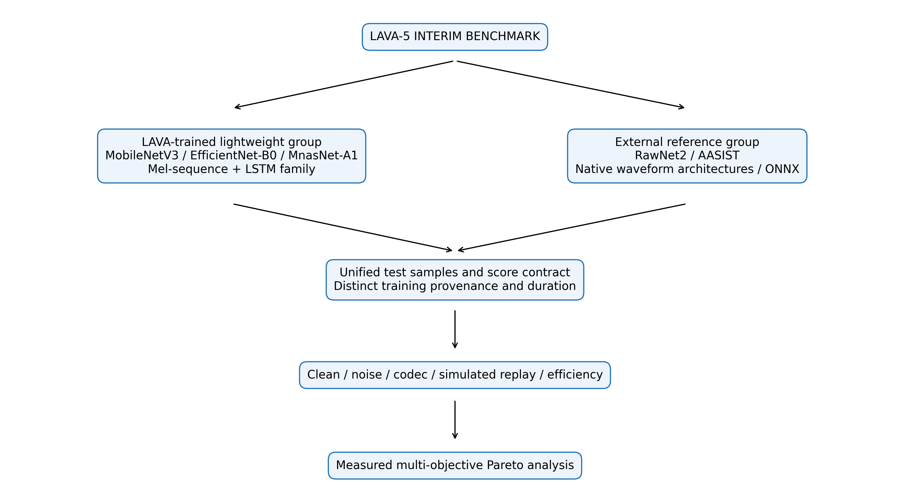
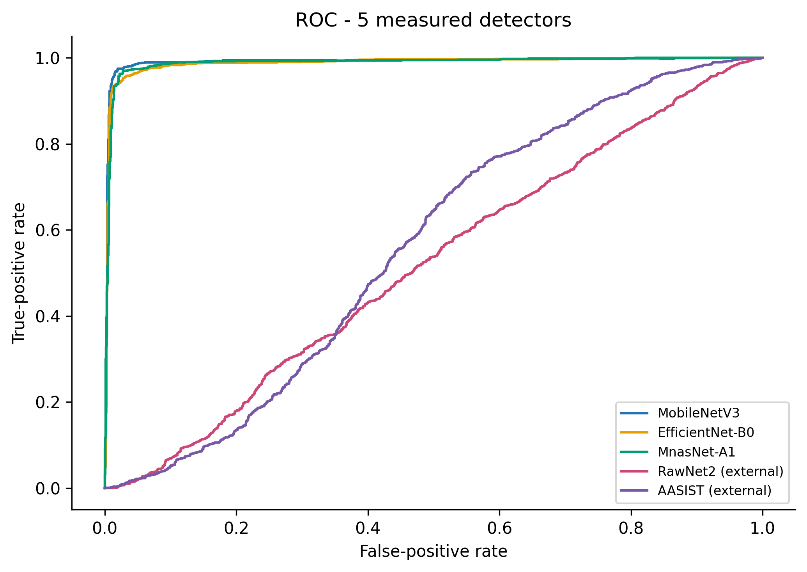
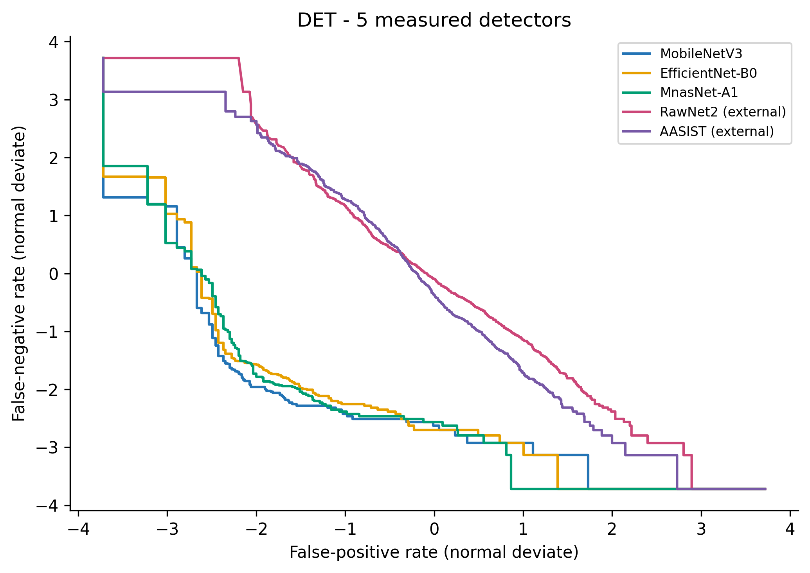
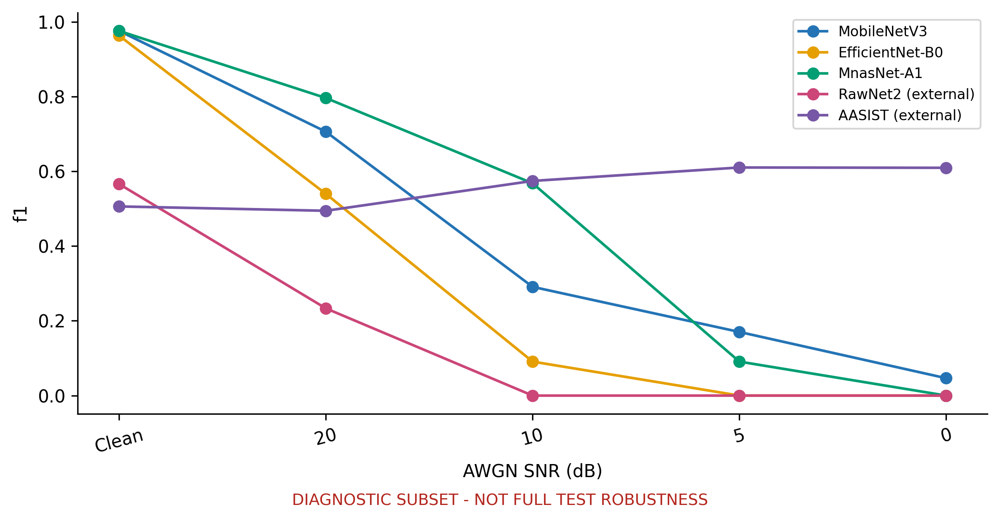
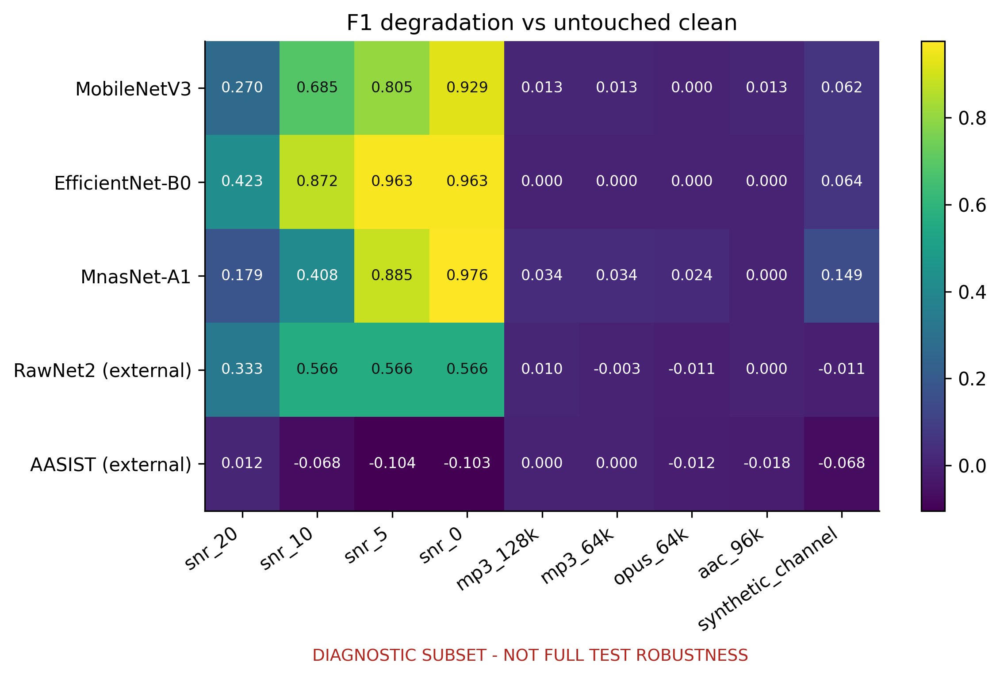
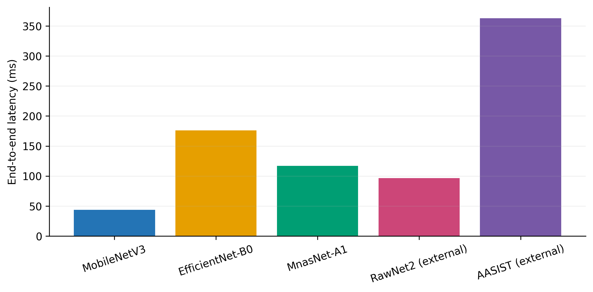
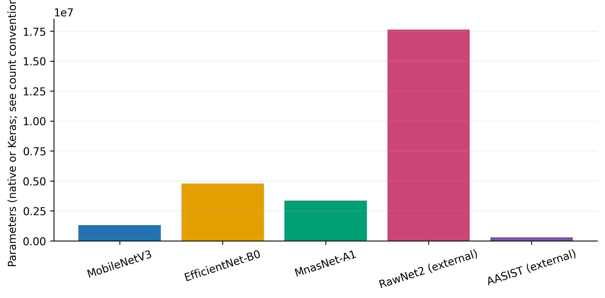
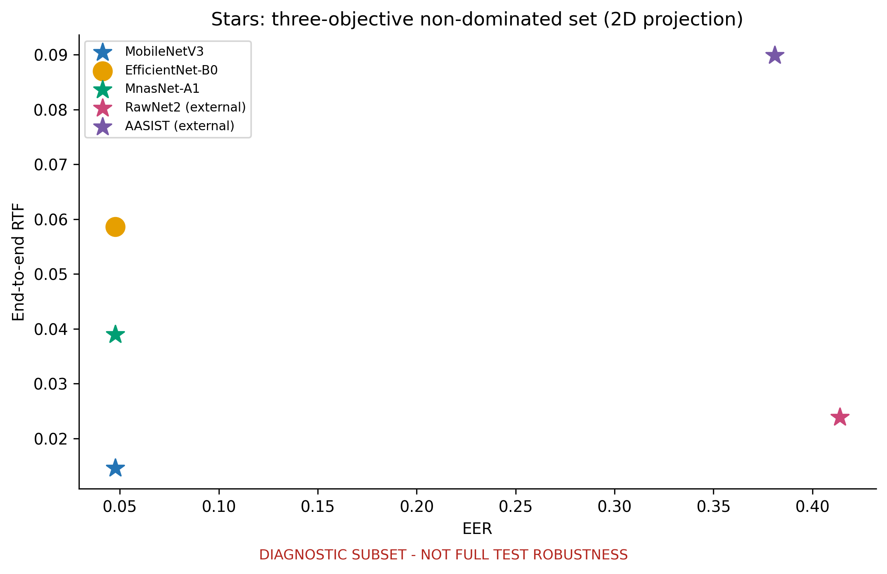
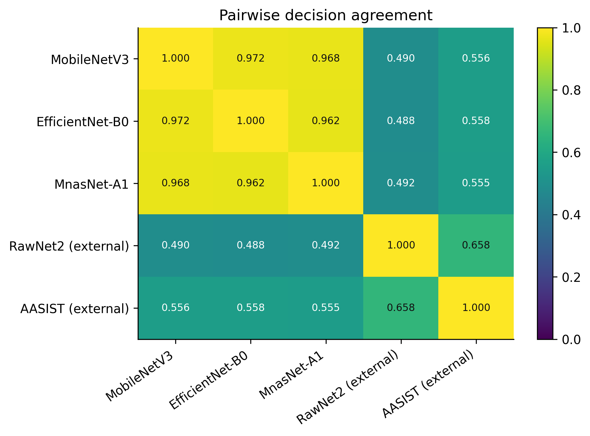

# LAVA: Khung Đánh giá Gọn nhẹ cho Phát hiện Giọng nói Deepfake Bền vững và Thời gian Thực

**Trạng thái bản thảo:** đánh giá thực nghiệm trung gian LAVA-5; chưa phải benchmark sáu detector hoàn chỉnh.

## Tóm tắt

Các detector giọng nói deepfake thường được so sánh trên các phân hoạch dữ liệu, quy ước điểm số, chuỗi tiền xử lý và giao thức đo thời gian khác nhau, khiến các nhận định về độ chính xác–hiệu quả khó diễn giải. Bài báo trình bày LAVA, một khung dựa trên registry để đánh giá các detector dị thể bằng cùng hợp đồng về nhãn, điểm số, toàn vẹn dữ liệu, độ bền vững và đo thời gian, đồng thời bảo toàn kiến trúc nội tại nguyên bản. Nghiên cứu trung gian hiện tại đánh giá năm artifact sẵn có: ba detector chuỗi Mel được huấn luyện cục bộ—MobileNetV3Small-LSTM, EfficientNet-B0-LSTM và MnasNet-A1-LSTM—cùng hai mô hình tham chiếu chống giả mạo RawNet2 và AASIST được huấn luyện trước từ bên ngoài. Phân nhóm SHA-256 đã cách ly 30 file giống hệt theo byte nhưng khác nhãn và ngăn rò rỉ checksum giữa các split. Đánh giá clean dùng toàn bộ 2.737 bản ghi test chính tắc. MobileNetV3Small-LSTM đạt F1 0,9724, ROC-AUC 0,9911 và EER 2,50%; MnasNet-A1-LSTM đạt 0,9645, 0,9886 và 3,10%; EfficientNet-B0-LSTM đạt 0,9563, 0,9877 và 4,00%. Hai checkpoint ngoài cho kết quả thấp hơn đáng kể theo giao thức dữ liệu và adapter hiện tại, nhưng khác biệt về provenance, thời lượng đầu vào, trạng thái threshold và tiền xử lý không cho phép diễn giải đây là so sánh thuần kiến trúc. Trên CPU desktop một luồng, độ trễ end-to-end đo được từ 43,8 đến 362,9 ms và tất cả detector có RTF dưới 0,1. Độ bền vững được đánh giá ở mức chẩn đoán—không phải kết quả toàn test—trên tập con phân tầng cố định 100 bản ghi với nhiễu trắng có seed, bốn vòng codec và một kênh replay mô phỏng. Codec gây suy giảm nhỏ ở các mô hình lightweight, trong khi nhiễu cộng làm suy giảm mạnh. Tập Pareto chẩn đoán ba mục tiêu gồm MobileNetV3, MnasNet, RawNet2 và AASIST; EfficientNet bị trội hoàn toàn trong tập con và môi trường timing này. Các kết quả hỗ trợ so sánh hướng triển khai có thể tái lập, nhưng chưa hỗ trợ tuyên bố về physical replay, unseen dataset, thiết bị edge, đa seed hay sáu mô hình.

**Từ khóa—** phát hiện giọng nói deepfake; chống giả mạo âm thanh; học sâu gọn nhẹ; độ bền vững; real-time factor; phân tích Pareto.

## 1. Giới thiệu

### 1.1 Bối cảnh và động lực

Giọng nói tổng hợp và chuyển đổi đặt ra rủi ro cho người nghe lẫn hệ thống xác thực người nói. ASVspoof đã chuẩn hóa các tình huống logical access và physical access [1], còn WaveFake mở rộng nguồn âm thanh sinh công khai [2]. Các detector hiện dùng nhiều hướng: đặc trưng âm học, waveform thô, graph attention và backbone tích chập gọn nhẹ. Tuy nhiên, chất lượng dự đoán đơn lẻ không cho biết detector có bền vững trước biến dạng kênh hay có phù hợp với giới hạn runtime hay không.

So sánh dễ sai lệch khi các hệ thống đảo thứ tự lớp, trả logit thay vì xác suất có cùng nghĩa, dùng thời lượng đầu vào khác nhau, hoặc đo riêng neural forward ở mô hình này nhưng đo toàn pipeline ở mô hình khác. Dữ liệu trùng lặp tạo rủi ro thứ hai: các bản âm thanh giống hệt theo byte nằm ở các split khác nhau có thể làm tăng ảo hiệu năng held-out. LAVA chuẩn hóa biên đánh giá thay vì ép mọi detector vào cùng một kiến trúc.

### 1.2 Khoảng trống nghiên cứu

RawNet2 xử lý trực tiếp waveform [6], AASIST duy trì tương tác graph phổ–thời gian [7], còn các CNN di động được thiết kế theo các nguyên lý hiệu quả khác nhau [3–5]. Ép các hệ thống này vào một topology sẽ làm mất tính đa dạng có ý nghĩa. Ngược lại, đánh giá không có hợp đồng chung sẽ trộn lẫn tác động của kiến trúc, semantics điểm số, dữ liệu và cách đo.

Repository hiện thực hóa biên chung đó nhưng bằng chứng vẫn mang tính trung gian. Ba artifact lightweight có lịch sử khởi tạo khác nhau, hai artifact tham chiếu được huấn luyện từ bên ngoài, ShuffleNetV2 chưa có artifact cuối hợp lệ, và robustness mới hoàn tất trên tập con chẩn đoán cố định. Bài báo báo cáo đúng phạm vi này, không giữ thiết kế sáu mô hình như thể đã được thực nghiệm.

### 1.3 Câu hỏi nghiên cứu

**RQ1:** Các detector CNN thời gian gọn nhẹ cạnh tranh như thế nào với hai hệ thống chống giả mạo pretrained bên ngoài trong giao thức clean chung của LAVA?

**RQ2:** Hiệu năng thay đổi như thế nào dưới các điều kiện noise, codec và simulated replay đã thực sự được chạy?

**RQ3:** Detector nào không bị trội hoàn toàn khi đồng thời xét EER, suy giảm độ bền vững trung bình và RTF end-to-end trong phạm vi chẩn đoán đã hoàn tất?

### 1.4 Đóng góp

Bài báo đóng góp: (1) hợp đồng `P(FAKE)` độc lập framework cho TensorFlow và detector PyTorch/ONNX bên ngoài; (2) giao thức toàn vẹn dữ liệu dựa trên checksum để cách ly xung đột nhãn và loại rò rỉ bản sao; (3) benchmark clean năm detector và robustness diagnostic có thể truy vết; (4) giao thức CPU chung tách preprocessing, model-only và end-to-end; (5) phân tích lỗi, bootstrap, agreement và Pareto từ số đo thật, không dùng điểm tổng hợp có trọng số tùy ý.

## 2. Công trình liên quan

### 2.1 Benchmark deepfake âm thanh và chống giả mạo

ASVspoof 2019 bao quát speech tổng hợp, chuyển đổi và replay, đồng thời dùng EER bên cạnh t-DCF [1]. WaveFake tập hợp âm thanh từ nhiều họ mô hình sinh và ngôn ngữ [2]. Chúng tạo bối cảnh nghiên cứu, nhưng dữ liệu LAVA hiện tại không được tuyên bố là tái tạo hai protocol này. Đặc biệt, repository chưa có đánh giá WaveFake được xác minh.

### 2.2 Mô hình waveform thô

RawNet2 được áp dụng cho chống giả mạo theo hướng end-to-end [6]. LAVA giữ input waveform, front end kiểu Sinc, khối residual thời gian, attention, GRU và classifier. Trọng số hiện tại là checkpoint bên ngoài, không phải artifact được LAVA huấn luyện lại.

### 2.3 Detector graph phổ–thời gian

AASIST tích hợp graph phổ và thời gian bằng heterogeneous graph attention, graph pooling, master/stack node và readout mở rộng [7]. LAVA chỉ thích nghi loader và score semantics, không biến AASIST thành Mel-CNN-LSTM.

### 2.4 Kiến trúc tích chập gọn nhẹ

MobileNetV3 kết hợp hardware-aware search với cải tiến kiến trúc [3]; EfficientNet scale đồng thời depth, width và resolution [4]; MnasNet đưa latency vào mục tiêu architecture search [5]. LAVA dùng chúng làm hàm embedding cho từng segment trong một meta-architecture audio–temporal có kiểm soát. Thành tích vision trong paper gốc không phải kết quả audio LAVA. ShuffleNetV2 [8] đã được implement cho registry tương lai nhưng bị loại khỏi toàn bộ bảng, đường cong và Pareto thực nghiệm do chưa có final artifact.

### 2.5 Robustness và đánh giá hướng triển khai

Noise, codec và replay có thể phá vỡ các dấu hiệu mà detector dựa vào. Giao thức hợp lệ cần sinh mỗi file stress một lần, dùng lại cho mọi model và so với đúng clean sample. FLOPs cũng không thay thế latency thực. Vì vậy LAVA đo kích thước artifact, RSS tiến trình, preprocessing, model-only, end-to-end, throughput và RTF. Kết quả hiện tại là bằng chứng CPU desktop, không phải thiết bị di động hay edge.

## 3. Phương pháp

### 3.1 Tổng quan LAVA

LAVA tách tính toán native của model khỏi tầng đánh giá chung (Hình 1). Detector specification khai báo framework, loại input, thời lượng, đường dẫn artifact và provenance. Benchmark khóa hash model, metadata, threshold, manifest và source inference trước khi chạy; báo cáo tính lại metrics từ scores theo từng sample.

Pipeline (Hình 2) kiểm tra manifest, load tuần tự từng artifact, đánh giá điểm không đổi, sinh stress audio dùng chung, đo runtime và tạo bảng/hình bằng chương trình.

### 3.2 Dataset và giao thức toàn vẹn

Dataset nội bộ nằm trong `data/REAL` và `data/FAKE`; speaker, source, generator, parent recording và dataset ID đều `UNKNOWN`. Vì vậy bài báo không tuyên bố speaker-, source-, generator-disjoint hay cross-dataset.

Inventory scan 18.722 file: 10.550 REAL và 8.172 FAKE. SHA-256 phát hiện 435 nhóm trùng, 476 file trùng dư thừa và 14 nhóm checksum khác nhãn gồm 30 file. Mọi thành viên khác nhãn bị cách ly ở manifest. Trong nhóm cùng nhãn, đường dẫn đứng đầu theo thứ tự từ điển được giữ làm đại diện. Manifest cuối gồm 18.232 bản ghi (10.493 REAL; 7.739 FAKE), chia deterministic seed 42 thành train 12.762, validation 2.733 và test 2.737. Claim hợp lệ duy nhất là **checksum-group-disjoint**. Manifest hash là `8b55591d58d3658b8cafe0e77b6ebdedbaa67be2e339730a7276fe9b10958df9`.

### 3.3 Tiền xử lý âm thanh chuẩn hóa

Với nhóm lightweight, audio được decode bằng SoundFile khi được hỗ trợ, lấy trung bình kênh để thành mono, resample bằng polyphase về 22.050 Hz và zero-pad/cắt thành 3,0 s (66.150 sample). Tín hiệu chia theo thời gian thành sáu segment không chồng lấp 0,5 s. Mỗi segment dùng STFT cửa sổ Hann, `n_fft=2048`, hop 512; Mel bank HTK tam giác 128 band từ 20–8.000 Hz. Power được đổi sang dB tương đối với cực đại segment, cắt trong 80 dB, tuyến tính hóa về [0,255], resize bilinear thành 224×224 và lặp thành ba kênh. Input cuối là float32 `6×224×224×3`.

Adapter tham chiếu dùng waveform mono 16 kHz dài 64.600 sample (4,0375 s), polyphase resampling và prefix/zero-padding. Loader gốc dùng librosa và repetition padding cho clip ngắn. Sai khác đã được ghi nhận và không bị thay đổi sau khi xem test. Parity native–ONNX chỉ chứng minh export trên cùng tensor adapter.

### 3.4 Các detector

**Bảng 1. Cấu hình detector và provenance.**

| Detector | Nhóm | Runtime | Input | Cơ chế | Tham số | Provenance |
|---|---|---|---|---|---:|---|
| MobileNetV3Small-LSTM | lightweight | TensorFlow 2.15 | Mel, 3,0 s | MobileNet 576-D + LSTM(128) | 1.308.401 | LAVA; ImageNet |
| EfficientNet-B0-LSTM | lightweight | TensorFlow 2.15 | Mel, 3,0 s | EfficientNet 1280-D + LSTM(128) | 4.779.300 | LAVA; ImageNet; warm-up best |
| MnasNet-A1-LSTM | lightweight | TensorFlow 2.15 | Mel, 3,0 s | MnasNet 1280-D + LSTM(128) | 3.369.255 | LAVA; scratch; early-stopped best |
| RawNet2 | tham chiếu | ONNX từ PyTorch | waveform, 4,0375 s | Sinc/residual/attention/GRU | 17.621.410 | checkpoint ngoài; README: ASVspoof 2019 LA |
| AASIST | tham chiếu | ONNX từ PyTorch | waveform, 4,0375 s | Sinc/encoder/heterogeneous graph attention | 297.866 | checkpoint ngoài; README: ASVspoof 2019 LA |

Nhóm lightweight dùng chung `TimeDistributed(backbone) → LSTM(128) → Dense(64, ReLU) → Dropout(0,4) → sigmoid`; không ép embedding về cùng chiều. RawNet2/AASIST giữ kiến trúc native. Keras count gồm state BatchNorm không trainable; native PyTorch count không gồm buffers.

### 3.5 Huấn luyện và provenance artifact

MobileNet dùng ImageNet và lifecycle hai stage: warm-up head khi backbone đóng băng, sau đó partial fine-tuning LR thấp với BatchNorm đóng băng. EfficientNet cũng khởi tạo ImageNet nhưng deployment hiện tại chỉ là checkpoint warm-up tốt nhất ở epoch 47 (`val_loss=0,1698`), chưa phải lifecycle fine-tune/global-best hoàn chỉnh. MnasNet được train scratch end-to-end từ epoch 1; artifact là best epoch 27 của run early stop ở epoch 39, với Adam `1e-4`, clip norm 1,0, label smoothing 0,1 và L2 `1e-5` theo implementation production.

RawNet2/AASIST không được LAVA train. Checkpoint `.pth` được strict-load rồi export ONNX. Sáu tensor audio thật cho sai khác `P(FAKE)` tối đa lần lượt `4,11×10⁻⁶` và `5,96×10⁻⁸`; đây là parity export, không phải bằng chứng cùng training pipeline.

### 3.6 Semantics điểm và threshold

LAVA cố định REAL=0, FAKE=1; mọi adapter trả (p=P(FAKE)):

$$\hat y=\begin{cases}1,&p\ge\tau,\\0,&p<\tau.\end{cases}\tag{1}$$

Threshold lightweight là 0,82 (MobileNet) và 0,90 (EfficientNet/MnasNet), được hiệu chỉnh theo F1 lớp FAKE trên validation. Hai reference giữ threshold mặc định 0,5 chưa calibrate. Test không chọn weight hay threshold, và score không được tuyên bố là xác suất ngoài đời đã calibration.

### 3.7 Giao thức clean

Toàn bộ 2.737 test sample (1.575 REAL, 1.162 FAKE) được dùng. Với FAKE là positive:

$$Precision=\frac{TP}{TP+FP},\quad Recall=\frac{TP}{TP+FN},\quad F1=\frac{2PR}{P+R}.\tag{2}$$

ROC-AUC dùng raw (P(FAKE)). Với threshold (\tau):

$$FAR(\tau)=\frac{FP}{FP+TN},\qquad FRR(\tau)=\frac{FN}{FN+TP}.\tag{3}$$

Implementation nội suy tại điểm đổi dấu đầu tiên của (FAR-FRR):

$$EER=\frac{FAR(\tau^*)+FRR(\tau^*)}{2},\quad FAR(\tau^*)\simeq FRR(\tau^*).\tag{4}$$

### 3.8 Stress test robustness

Do ước lượng runtime, robustness toàn test chưa chạy. Trước khi xem lỗi model, một subset phân tầng deterministic 100 sample (58 REAL, 42 FAKE; seed 42) được chọn. Clean baseline lấy đúng các ID này; output và figure được tách riêng, đánh dấu diagnostic.

Noise là AWGN có seed ở 20/10/5/0 dB theo RMS toàn prefix, lưu WAV float32. Compression dùng FFmpeg: MP3 128/64 kb/s, Opus 64 kb/s, AAC 96 kb/s; PCM16 là một phần round trip. Replay mô phỏng dùng tap 0/17/43/89 ms, gain 1/0,45/0,25/0,12, chuẩn hóa cố định và Butterworth band-pass bậc bốn 100–3.800 Hz. Đây không phải physical replay hay measured RIR. (\Delta F1=F1_{clean}-F1_{stress}), thấp hơn tốt hơn; mean lấy đều chín condition, không dùng trọng số tùy ý. Không có unseen dataset result.

### 3.9 Hiệu quả tính toán

Mỗi model chạy tuần tự trong tiến trình cô lập trên cùng CPU Windows desktop, float32, batch 1, một computational thread. Mười warm-up đi trước 50 lần đo. Hệ thống lưu mean/median/std/P95, preprocessing, model-only, end-to-end, throughput, load và RSS tiến trình lấy mẫu mỗi 20 ms. Startup và graph tracing bị loại; RSS không phải model-only allocation.

$$RTF=\frac{T_{processing}}{T_{audio}},\qquad Throughput=\frac{N_{clips}}{T_{total}},\qquad S_{model}=\frac{bytes}{1024^2}.\tag{5}$$

RTF<1 chỉ nghĩa là offline processing nhanh hơn thời lượng clip, không chứng minh causal streaming hay edge deployment.

### 3.10 Pareto

Pareto diagnostic tối thiểu hóa EER clean-subset, mean ΔF1 và RTF end-to-end. (A) trội (B) khi:

$$f_i(A)\le f_i(B)\ \forall i,\qquad \exists j:f_j(A)<f_j(B).\tag{6}$$

Không có weighted score. Vì robustness chỉ là subset, frontier chính thức vẫn `NOT_RUN`.

### 3.11 Thống kê và lỗi

Scores clean hỗ trợ 1.000 bootstrap phân tầng dùng chung seed 42, tạo percentile CI 95% cho F1/AUC/EER. Đây là bất định test-sample, không phải multi-seed. Exact McNemar với Holm adjustment và paired bootstrap được áp dụng sau khi kiểm tra alignment ID; agreement/error overlap dùng cùng thứ tự sample.

## 4. Kết quả

### 4.1 Phạm vi artifact

Năm artifact đều PASS load, kiểm tra score hữu hạn, probe hai lớp, hash và public-adapter parity. Hai reference PASS native checkpoint–ONNX parity. ShuffleNetV2 giữ `TRAINING_PENDING`, không được load hay đưa vào bất kỳ kết quả nào.

### 4.2 RQ1—hiệu năng clean

**Bảng 2. Hiệu năng trên toàn test chính tắc.**

| Model | Accuracy | Precision | Recall | F1 | Macro F1 | AUC | EER | TN/FP/FN/TP |
|---|---:|---:|---:|---:|---:|---:|---:|---|
| MobileNetV3 | 0,9766 | 0,9741 | 0,9707 | **0,9724** | **0,9761** | **0,9911** | **0,0250** | 1545/30/34/1128 |
| EfficientNet-B0 | 0,9635 | 0,9724 | 0,9406 | 0,9563 | 0,9624 | 0,9877 | 0,0400 | 1544/31/69/1093 |
| MnasNet-A1 | 0,9697 | 0,9599 | 0,9690 | 0,9645 | 0,9690 | 0,9886 | 0,0310 | 1528/47/36/1126 |
| RawNet2 ngoài | 0,4936 | 0,4380 | 0,6807 | 0,5330 | 0,4900 | 0,5178 | 0,4813 | 560/1015/371/791 |
| AASIST ngoài | 0,5513 | 0,4758 | 0,5585 | 0,5139 | 0,5487 | 0,5597 | 0,4463 | 860/715/513/649 |

Ba artifact lightweight vượt hai reference trong giao thức cụ thể này; MobileNet đứng đầu mọi aggregate clean. Đây không phải ranking thuần kiến trúc vì provenance, threshold, duration và preprocessing khác nhau.

### 4.3 RQ2—robustness diagnostic

**Bảng 3. Mean ΔF1 trên 100 sample ghép cặp; thấp hơn tốt hơn.**

| Model | Clean F1 | Noise | Codec | Replay mô phỏng | Mean 9 condition |
|---|---:|---:|---:|---:|---:|
| MobileNetV3 | 0,9756 | 0,6722 | 0,0095 | 0,0620 | 0,3099 |
| EfficientNet-B0 | 0,9630 | 0,8053 | 0,0000 | 0,0641 | 0,3650 |
| MnasNet-A1 | 0,9756 | 0,6119 | 0,0233 | 0,1489 | 0,2989 |
| RawNet2 ngoài | 0,5660 | 0,5077 | −0,0007 | −0,0109 | 0,2241 |
| AASIST ngoài | 0,5060 | −0,0660 | −0,0074 | −0,0682 | −0,0402 |

Codec chỉ làm thay đổi F1 nhỏ ở lightweight, trong khi AWGN gây suy giảm lớn. Replay đưa F1 về 0,9136/0,8989/0,8267 tương ứng MobileNet/EfficientNet/MnasNet. Suy giảm âm của baseline ngoài yếu không chứng minh robustness tốt; subset nhỏ có thể đổi score distribution ngẫu nhiên.

### 4.4 Hiệu quả tính toán

**Bảng 4. Hiệu quả CPU desktop một luồng.**

| Model | Params | MiB | RSS MiB | Pre ms | Model ms | Mean/P95 ms | Clips/s | RTF |
|---|---:|---:|---:|---:|---:|---:|---:|---:|
| MobileNetV3 | 1.308.401 | 5,64 | 554,6 | 13,43 | 30,07 | **43,81/52,12** | **22,83** | **0,0146** |
| EfficientNet-B0 | 4.779.300 | 18,96 | 651,2 | 13,59 | 168,36 | 175,85/196,11 | 5,69 | 0,0586 |
| MnasNet-A1 | 3.369.255 | 13,43 | 566,0 | 13,60 | 95,25 | 117,00/138,96 | 8,55 | 0,0390 |
| RawNet2 ngoài | 17.621.410 | 67,65 | 249,5 | 0,63 | 95,10 | 96,54/102,62 | 10,36 | 0,0239 |
| AASIST ngoài | 297.866 | **1,61** | 442,5 | **0,47** | 359,61 | 362,91/398,45 | 2,76 | 0,0899 |

MobileNet có latency/RTF tốt nhất; AASIST có file nhỏ nhất nhưng latency lớn nhất. Param hay size riêng lẻ không dự báo runtime. Mọi RTF<0,1 nhưng không phải streaming/edge validation.

### 4.5 RQ3—Pareto thăm dò

**Bảng 5. Pareto diagnostic ba mục tiêu.**

| Model | EER subset | Mean ΔF1 | RTF | Pareto? |
|---|---:|---:|---:|---|
| MobileNetV3 | 0,0476 | 0,3099 | 0,0146 | Có |
| EfficientNet-B0 | 0,0476 | 0,3650 | 0,0586 | Không |
| MnasNet-A1 | 0,0476 | 0,2989 | 0,0390 | Có |
| RawNet2 ngoài | 0,4138 | 0,2241 | 0,0239 | Có |
| AASIST ngoài | 0,3810 | −0,0402 | 0,0899 | Có |

MobileNet trội EfficientNet ở cả ba mục tiêu diagnostic. Frontier bốn model không nghĩa là bốn model tốt ngang nhau: reference đạt degradation nhỏ một phần vì clean thấp. Cần đọc Pareto cùng chất lượng tuyệt đối và provenance.

### 4.6 Phân tích lỗi và agreement

Trên full clean test, 912 sample được cả năm model dự đoán đúng và 11 sample bị cả năm dự đoán sai. Ba lightweight đồng thuận đúng trong khi cả hai reference sai ở 788 sample; chiều ngược lại có tám sample. Agreement trong nhóm lightweight là 0,962–0,972; lightweight–RawNet2 khoảng 0,488–0,492; lightweight–AASIST 0,555–0,558; RawNet2–AASIST 0,658. Cấu trúc cụm phù hợp khác biệt pipeline nhưng agreement không đồng nghĩa correctness hay independence.

### 4.7 Bất định thống kê

**Bảng 6. Percentile CI 95% từ 1.000 bootstrap phân tầng full test.**

| Model | F1 CI | AUC CI | EER CI |
|---|---|---|---|
| MobileNetV3 | [0,9654; 0,9788] | [0,9871; 0,9947] | [0,0178; 0,0311] |
| EfficientNet | [0,9477; 0,9651] | [0,9833; 0,9917] | [0,0311; 0,0482] |
| MnasNet | [0,9573; 0,9717] | [0,9842; 0,9923] | [0,0250; 0,0379] |
| RawNet2 | [0,5150; 0,5489] | [0,4944; 0,5395] | [0,4616; 0,5016] |
| AASIST | [0,4928; 0,5349] | [0,5377; 0,5815] | [0,4279; 0,4660] |

Paired CI chênh F1 MobileNet–EfficientNet là [0,0088;0,0232], MobileNet–MnasNet [0,0003;0,0155]. Ý nghĩa thống kê trên test này không loại bỏ domain/provenance confounding.

### 4.8 Thảo luận

RQ1 được trả lời trong phạm vi hẹp: ba hệ thống lightweight cục bộ vượt reference ngoài trên clean protocol, MobileNet có aggregate và runtime mạnh nhất. Điều này không mâu thuẫn paper gốc của RawNet2/AASIST vì dataset, threshold và adapter khác. RQ2 cho thấy codec ít gây hại hơn AWGN cho lightweight; negative degradation của AASIST không nên được gọi là ưu thế do clean baseline thấp. RQ3 cho thấy Pareto membership không phải xếp hạng; frontier có thể thay đổi theo hardware, calibration hay full-test robustness.

## 5. Hạn chế

Đây là đánh giá trung gian năm model; ShuffleNetV2 chưa có final artifact. Provenance training dị thể: MobileNet/EfficientNet dùng ImageNet, MnasNet scratch, EfficientNet chỉ warm-up, RawNet2/AASIST là checkpoint ngoài. Metadata speaker/source/generator thiếu nên chỉ claim checksum-group-disjoint. Robustness chỉ có 100 sample; full-test robustness là `NOT_RUN`. Noise là AWGN, replay chỉ mô phỏng, không có unseen dataset. Reference adapter khác loader gốc và threshold chưa calibrate. Timing chỉ trên một CPU Windows desktop, RSS là toàn tiến trình. Mỗi artifact chỉ đại diện một run; bootstrap test không thay multi-seed. Việc test set từng được xem trong quá trình phát triển cũng làm yếu cách hiểu independent hold-out tuyệt đối.

## 6. Kết luận

LAVA cho thấy cách so sánh các detector giọng nói dị thể mà không phá kiến trúc native. Manifest theo checksum, score `P(FAKE)`, artifact được khóa hash, stress waveform dùng chung và timing CPU tạo thành benchmark trung gian năm detector có thể truy vết. MobileNetV3Small-LSTM đạt F1, AUC, EER và latency clean tốt nhất. Robustness diagnostic cho thấy codec ít gây suy giảm hơn AWGN SNR thấp trong nhóm lightweight. Pareto minh họa nhiều trade-off nhưng chỉ đúng với subset. Cần full-test robustness, physical replay, unseen dataset, edge hardware, nhiều seed và artifact ShuffleNet hợp lệ trước khi tuyên bố Full LAVA sáu mô hình.

## Lời cảm ơn

Phần mềm và artifact thực nghiệm được phát triển bởi Phan Khắc Anh Tuấn, Nguyễn Phương Chinh, Lại Thành Đạt, Nguyễn Tấn Khiêm và Trương Thành Đạt. Bài báo không tuyên bố nguồn tài trợ bên ngoài.

## Phụ lục A. Khả năng tái lập và artifact phần mềm

Manifest chính tắc nằm ở `data/manifests/`; detector registry/adapter ở `src/lava/`; bundle triển khai ở `models/`; clean scores và efficiency ở `outputs/lava_5/`; stress diagnostic và Pareto thăm dò ở `outputs/lava_5/diagnostic_100/`. `benchmark/lava5.py` điều phối inference; `lava5_stress.py` sinh condition; `lava5_report.py` tính lại số liệu/hình; `scripts/lava5_acceptance.py` kiểm tra alignment, hash, threshold, parity và scope. Tái lập benchmark này tuyệt đối không gọi `train.py`.

## Tài liệu tham khảo

[1] M. Todisco *et al.*, “ASVspoof 2019: Future Horizons in Spoofed and Fake Audio Detection,” Proc. Interspeech, 2019, doi: 10.21437/Interspeech.2019-2249.

[2] J. Frank and L. Schönherr, “WaveFake: A Data Set to Facilitate Audio Deepfake Detection,” NeurIPS Datasets and Benchmarks, 2021, arXiv:2111.02813.

[3] A. Howard *et al.*, “Searching for MobileNetV3,” Proc. ICCV, 2019, pp. 1314–1324, doi: 10.1109/ICCV.2019.00140.

[4] M. Tan and Q. V. Le, “EfficientNet: Rethinking Model Scaling for Convolutional Neural Networks,” Proc. ICML, PMLR 97, 2019, pp. 6105–6114.

[5] M. Tan *et al.*, “MnasNet: Platform-Aware Neural Architecture Search for Mobile,” Proc. CVPR, 2019, pp. 2820–2828, doi: 10.1109/CVPR.2019.00293.

[6] H. Tak, J. Patino, M. Todisco, A. Nautsch, N. Evans, and A. Larcher, “End-to-End Anti-Spoofing with RawNet2,” Proc. ICASSP, 2021, pp. 6369–6373, doi: 10.1109/ICASSP39728.2021.9414234.

[7] J.-w. Jung *et al.*, “AASIST: Audio Anti-Spoofing Using Integrated Spectro-Temporal Graph Attention Networks,” Proc. ICASSP, 2022, pp. 6367–6371, doi: 10.1109/ICASSP43922.2022.9747766.

[8] N. Ma, X. Zhang, H.-T. Zheng, and J. Sun, “ShuffleNet V2: Practical Guidelines for Efficient CNN Architecture Design,” Proc. ECCV, 2018, pp. 116–131.
